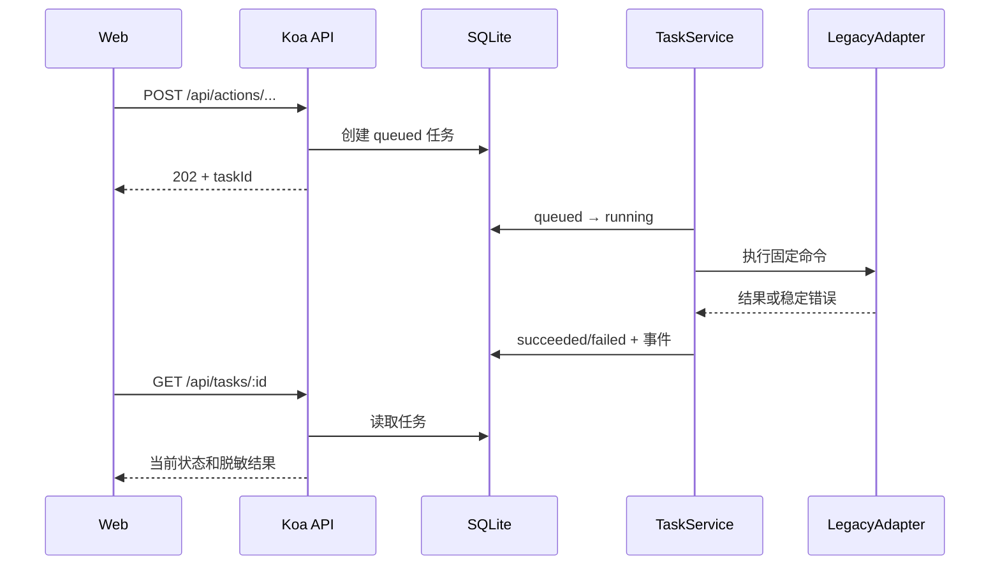
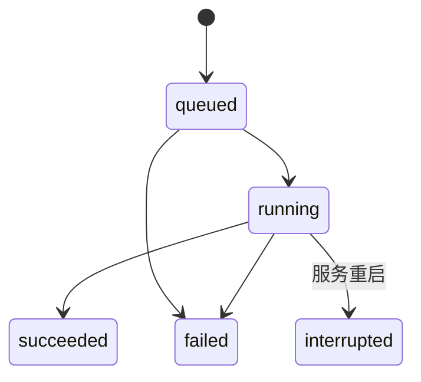
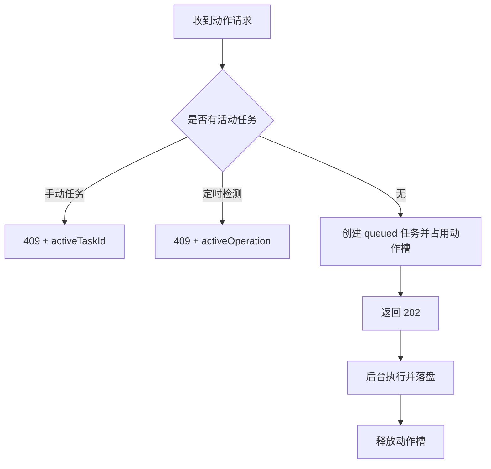

# Clash Sentinel API 设计

状态：Step 5 实现契约。本文先于代码冻结；共享 Zod Schema、Koa 路由和测试必须与本文一致。

依据：[项目规划](../PROJECT_PLAN.md)、[实施步骤](../STEP.md)、[数据库设计](database-design.md)。

## 1. 通用约定

- 服务仅监听 `127.0.0.1:3000`，由同源 Web 页面调用，不启用 CORS。
- Content-Type 为 `application/json`；JSON 请求体最大 32 KiB，未知字段一律拒绝。
- 读取接口只访问 SQLite，不启动 Shell、不执行网络检测、不创建任务或事件。
- API 请求处理超时为 10 秒；已返回 `202` 的后台任务使用 LegacyAdapter 自身超时。
- 每个响应包含 `X-Request-Id`；错误响应同时在正文提供 `requestId`。

成功响应：

```json
{
  "ok": true,
  "data": {
    "service": "clash-sentinel",
    "status": "ok"
  }
}
```

动作冲突失败响应：

```json
{
  "ok": false,
  "error": {
    "code": "ACTION_CONFLICT",
    "message": "已有操作正在执行",
    "details": {
      "activeTaskId": "550e8400-e29b-41d4-a716-446655440000"
    }
  },
  "requestId": "c60a62f0-e6a8-4f87-b9de-3a950b43182f"
}
```

定时健康检测占用全局槽时没有数据库任务 ID，冲突详情改为活动操作：

```json
{
  "ok": false,
  "error": {
    "code": "ACTION_CONFLICT",
    "message": "定时健康检测正在执行",
    "details": {
      "activeOperation": "scheduled_health"
    }
  },
  "requestId": "a26af7b6-7df5-4658-9c5c-f39162de408c"
}
```

失败响应：

```json
{
  "ok": false,
  "error": {
    "code": "VALIDATION_ERROR",
    "message": "请求参数无效",
    "details": { "issues": ["ip"] }
  },
  "requestId": "550e8400-e29b-41d4-a716-446655440000"
}
```

`details` 只包含字段路径、当前任务 ID 或固定活动操作等脱敏上下文，不返回输入原文、堆栈、本机路径、配置或密钥。

## 2. HTTP 状态与错误码

| HTTP | 错误码 | 含义 |
| --- | --- | --- |
| `400` | `INVALID_JSON` | 请求体不是合法 JSON 或超过大小限制 |
| `400` | `VALIDATION_ERROR` | 路径、查询或请求体不符合 Schema |
| `404` | `NOT_FOUND` | API 路由或指定任务不存在 |
| `409` | `ACTION_CONFLICT` | 已有 Legacy 动作运行，详情含 `activeTaskId` |
| `409` | `NO_DIAGNOSIS` | 没有可用于 apply 的最近诊断 |
| `409` | `INVALID_CANDIDATE` | 诊断被跳过、IP 不在报告内或候选不合格 |
| `409` | `AUTO_SWITCH_REQUIRES_LOCK` | 当前入口未受管锁定，不能开启自动切换 |
| `409` | `PROFILE_MISMATCH` | 自动切换绑定 UID 与当前订阅不一致 |
| `504` | `REQUEST_TIMEOUT` | HTTP 请求处理超过 10 秒 |
| `500` | `INTERNAL_ERROR` | 未知内部错误，响应不暴露原始异常 |

Legacy 后台执行错误不会改写已经返回的 `202`；稳定错误码和脱敏说明写入任务，客户端通过任务接口读取。

## 3. 读取接口

### 3.1 `GET /api/health`

确认 Koa 进程可响应，不代表 Clash 或互联网健康。无请求参数和副作用。

```json
{
  "ok": true,
  "data": { "service": "clash-sentinel", "status": "ok" }
}
```

### 3.2 `GET /api/status`

读取 SQLite 当前健康快照，不得为填充响应执行 Legacy `status`。已有快照时返回完整结构：

```json
{
  "ok": true,
  "data": {
    "snapshot": {
      "status": "healthy",
      "profile": {
        "uid": "profile-demo-001",
        "name": "演示订阅"
      },
      "lock": {
        "locked": true,
        "domain": "entry.example.test",
        "ip": "198.51.100.20"
      },
      "internetSuccess": 3,
      "internetTotal": 3,
      "consecutiveFailures": 0,
      "recommendedIp": "198.51.100.21",
      "autoSwitchCooldownUntil": "2026-09-08T04:10:00.000Z",
      "updatedAt": "2026-09-08T04:05:00.000Z"
    }
  }
}
```

首次启动尚无快照时：

```json
{
  "ok": true,
  "data": {
    "snapshot": null
  }
}
```

### 3.3 `GET /api/sites`

始终返回六个固定键。下面同时展示可达、不可达以及 OpenAI 官方状态字段：

```json
{
  "ok": true,
  "data": {
    "sites": {
      "baidu": {
        "target": "baidu",
        "reachable": true,
        "httpStatus": 200,
        "durationMs": 48.5,
        "errorType": null,
        "checkedAt": "2026-09-08T04:05:00.000Z",
        "serviceStatus": null,
        "incidentSummary": null,
        "stale": false
      },
      "taobao": {
        "target": "taobao",
        "reachable": true,
        "httpStatus": 200,
        "durationMs": 61.2,
        "errorType": null,
        "checkedAt": "2026-09-08T04:05:01.000Z",
        "serviceStatus": null,
        "incidentSummary": null,
        "stale": false
      },
      "tencent": null,
      "google": {
        "target": "google",
        "reachable": false,
        "httpStatus": null,
        "durationMs": null,
        "errorType": "timeout",
        "checkedAt": "2026-09-08T04:05:02.000Z",
        "serviceStatus": null,
        "incidentSummary": null,
        "stale": false
      },
      "github": {
        "target": "github",
        "reachable": true,
        "httpStatus": 200,
        "durationMs": 325.8,
        "errorType": null,
        "checkedAt": "2026-09-08T04:05:03.000Z",
        "serviceStatus": null,
        "incidentSummary": null,
        "stale": false
      },
      "openai_status": {
        "target": "openai_status",
        "reachable": true,
        "httpStatus": 200,
        "durationMs": 412.3,
        "errorType": null,
        "checkedAt": "2026-09-08T04:05:04.000Z",
        "serviceStatus": "degraded",
        "incidentSummary": "示例 API 服务响应延迟升高",
        "stale": false
      }
    }
  }
}
```

尚未检测的目标使用 `null`；即使部分目标没有结果，六个键也不会省略。`stale` 不写入数据库，而是在读取时以 `checkedAt` 是否早于当前时间两个检测周期动态计算。

### 3.4 `GET /api/candidates`

读取最近一次脱敏诊断及候选。可测试诊断的完整响应：

```json
{
  "ok": true,
  "data": {
    "diagnosis": {
      "id": "69fe2ea8-71b8-46c5-92ee-1cbef01d9f22",
      "status": "testable",
      "generatedAt": "2026-09-08T04:00:00.000Z",
      "profile": {
        "uid": "profile-demo-001",
        "name": "演示订阅"
      },
      "domain": "entry.example.test",
      "skipReason": null,
      "detail": null,
      "testedPorts": [7001, 7002],
      "testRounds": 3,
      "candidates": [
        {
          "ip": "198.51.100.20",
          "eligible": true,
          "success": 6,
          "total": 6,
          "successRate": 100,
          "averageMs": 18.4,
          "failedPorts": [],
          "sources": ["system", "public_dns"]
        },
        {
          "ip": "198.51.100.21",
          "eligible": false,
          "success": 4,
          "total": 6,
          "successRate": 66.67,
          "averageMs": 92.1,
          "failedPorts": [7002],
          "sources": ["public_dns"]
        }
      ],
      "recommendedIp": "198.51.100.20",
      "savedAt": "2026-09-08T04:00:02.000Z"
    }
  }
}
```

诊断被跳过时仍保存完整诊断元数据，但没有候选和推荐 IP：

```json
{
  "ok": true,
  "data": {
    "diagnosis": {
      "id": "8698cf21-65dd-4fbf-98cd-48bd2ee1aca2",
      "status": "skipped",
      "generatedAt": "2026-09-08T04:15:00.000Z",
      "profile": {
        "uid": "profile-demo-001",
        "name": "演示订阅"
      },
      "domain": null,
      "skipReason": "multiple_domains",
      "detail": "订阅包含多个入口域名，无法生成单一候选集合",
      "testedPorts": [],
      "testRounds": 3,
      "candidates": [],
      "recommendedIp": null,
      "savedAt": "2026-09-08T04:15:01.000Z"
    }
  }
}
```

没有任何诊断时：

```json
{
  "ok": true,
  "data": {
    "diagnosis": null
  }
}
```

`StoredDiagnosis` 只包含订阅摘要、入口域名、候选结果、推荐 IP 和时间，不包含原始 TSV 或路径。

### 3.5 `GET /api/events`

查询参数：`limit` 默认 `50`，范围 `1..100`；`offset` 默认 `0`，必须为非负整数。未知查询参数拒绝。

```json
{
  "ok": true,
  "data": {
    "items": [
      {
        "id": 42,
        "type": "apply_succeeded",
        "severity": "info",
        "retention": "critical",
        "summary": "应用候选 IP 已完成",
        "details": null,
        "taskId": "705236fe-83b1-44c3-a378-9f058c2a5a38",
        "profileUid": "profile-demo-001",
        "occurredAt": "2026-09-08T04:20:05.000Z"
      },
      {
        "id": 41,
        "type": "health_check_failed",
        "severity": "error",
        "retention": "ordinary",
        "summary": "健康检查失败",
        "details": {
          "errorCode": "TIMEOUT"
        },
        "taskId": "6f66bdc7-3018-49c4-ab0f-8d19a67247cb",
        "profileUid": null,
        "occurredAt": "2026-09-08T04:18:00.000Z"
      }
    ],
    "limit": 50,
    "offset": 0,
    "total": 42
  }
}
```

事件按 `occurredAt`、`id` 倒序返回。接口只读，不触发历史清理。

### 3.6 `GET /api/settings`

返回完整 `Settings`，包括服务端生成的 `updatedAt`。无副作用。

```json
{
  "ok": true,
  "data": {
    "settings": {
      "checkIntervalMs": 60000,
      "requestTimeoutMs": 5000,
      "entryFailureThreshold": 3,
      "autoSwitchCooldownMs": 300000,
      "monitoringEnabled": true,
      "autoSwitchEnabled": false,
      "autoSwitchProfileUid": null,
      "updatedAt": "2026-09-08T04:25:00.000Z"
    }
  }
}
```

### 3.7 `GET /api/tasks/:id`

`id` 必须是 UUID。下面是已成功健康检查任务的完整响应：

```json
{
  "ok": true,
  "data": {
    "task": {
      "id": "6f66bdc7-3018-49c4-ab0f-8d19a67247cb",
      "type": "health_check",
      "status": "succeeded",
      "createdAt": "2026-09-08T04:17:58.000Z",
      "startedAt": "2026-09-08T04:17:58.050Z",
      "finishedAt": "2026-09-08T04:18:00.000Z",
      "input": null,
      "result": {
        "status": "healthy",
        "profile": {
          "uid": "profile-demo-001",
          "name": "演示订阅"
        },
        "lock": {
          "locked": true,
          "domain": "entry.example.test",
          "ip": "198.51.100.20"
        },
        "internetSuccess": 3,
        "internetTotal": 3,
        "consecutiveFailures": 0,
        "recommendedIp": null,
        "autoSwitchCooldownUntil": null,
        "updatedAt": "2026-09-08T04:18:00.000Z"
      },
      "errorCode": null,
      "errorMessage": null
    }
  }
}
```

后台执行失败的任务仍通过 HTTP `200` 查询，失败体现在任务字段中：

```json
{
  "ok": true,
  "data": {
    "task": {
      "id": "9e217620-a300-4f89-b4ce-bfaecb5f032e",
      "type": "rollback",
      "status": "failed",
      "createdAt": "2026-09-08T04:30:00.000Z",
      "startedAt": "2026-09-08T04:30:00.020Z",
      "finishedAt": "2026-09-08T04:30:00.300Z",
      "input": null,
      "result": null,
      "errorCode": "NO_BACKUP",
      "errorMessage": "没有可回滚的成功应用"
    }
  }
}
```

路径格式非法返回 `400 VALIDATION_ERROR`，任务不存在返回 `404 NOT_FOUND`。

## 4. 设置接口

### `PUT /api/settings`

请求体必须完整包含以下可编辑字段，不接收 `updatedAt`：

```json
{
  "checkIntervalMs": 60000,
  "requestTimeoutMs": 5000,
  "entryFailureThreshold": 3,
  "autoSwitchCooldownMs": 300000,
  "monitoringEnabled": true,
  "autoSwitchEnabled": false,
  "autoSwitchProfileUid": null
}
```

- 关闭自动切换时，服务端强制将 `autoSwitchProfileUid` 保存为 `null`。
- 开启时必须没有活动 Legacy 动作，当前 SQLite 健康快照必须已锁定，且绑定 UID 等于快照订阅 UID。
- 成功返回 HTTP `200` 和完整的服务端设置：

```json
{
  "ok": true,
  "data": {
    "settings": {
      "checkIntervalMs": 60000,
      "requestTimeoutMs": 5000,
      "entryFailureThreshold": 3,
      "autoSwitchCooldownMs": 300000,
      "monitoringEnabled": true,
      "autoSwitchEnabled": false,
      "autoSwitchProfileUid": null,
      "updatedAt": "2026-09-08T04:25:00.000Z"
    }
  }
}
```

- 该接口只更新策略，不启动检测或 Shell，不中断正在执行的任务；但活动任务期间不允许开启自动切换。

## 5. 动作接口

### 5.1 通用任务语义

`health-check`、`diagnose`、`apply`、`reset`、`rollback` 共用一个进程内全局动作槽。检查、创建任务和占用槽之间不经过异步等待；已有动作时返回 `409 ACTION_CONFLICT`。

成功受理统一返回 HTTP `202`：

```json
{
  "ok": true,
  "data": {
    "taskId": "550e8400-e29b-41d4-a716-446655440000",
    "status": "queued"
  }
}
```





### 5.2 `POST /api/actions/health-check`

请求体必须为 `{}`。后台执行与定时监测相同的完整六站检测；国内至少两个站点成功且入口已锁定时，再执行 Legacy `healthCheck()`，补齐订阅、入口和连续失败信息，保存站点历史及健康快照。保留已有冷却截止时间。

```json
{}
```

### 5.3 `POST /api/actions/diagnose`

请求体必须为 `{}`。后台执行严格诊断，事务化替换最近诊断及候选，并记录普通事件。

```json
{}
```

### 5.4 `POST /api/actions/apply`

请求体：

```json
{ "ip": "198.51.100.20" }
```

API 入队前要求 IP 是严格 IPv4，最近诊断状态为 `testable`，且同一 IP 候选存在并标记 `eligible`。后台 LegacyAdapter 仍复核报告有效期、订阅 UID、原始文件指纹和候选资格。

成功或 `no_change` 后刷新订阅和锁定身份，将综合状态置为 `unknown`、互联网结果置空、连续失败归零、推荐 IP 清空，保留已有冷却截止时间，并记录关键事件。

### 5.5 `POST /api/actions/reset`

请求体必须为 `{}`。最终锁定状态和控制接口校验由 LegacyAdapter 完成。成功或 `no_change` 后刷新身份、将综合状态置为 `unknown`，清空互联网健康计数、推荐 IP 和冷却截止时间，同时关闭自动切换并清空绑定 UID，记录关键事件。

```json
{}
```

### 5.6 `POST /api/actions/rollback`

请求体必须为 `{}`。备份及上下文检查由 LegacyAdapter 完成。成功后刷新身份，将综合状态置为 `unknown`、互联网结果置空、连续失败归零、推荐 IP 清空，保留已有冷却截止时间，并记录关键事件。

```json
{}
```

### 5.7 各动作完成后的任务结果

动作受理响应中的 `taskId` 用于查询 `GET /api/tasks/:id`。完整任务结构与 3.7 节相同；不同动作成功时的 `result` 如下。

诊断成功任务：

```json
{
  "ok": true,
  "data": {
    "task": {
      "id": "ff015f90-114a-410b-a9c7-3d9675bd9c72",
      "type": "diagnose",
      "status": "succeeded",
      "createdAt": "2026-09-08T04:35:00.000Z",
      "startedAt": "2026-09-08T04:35:00.020Z",
      "finishedAt": "2026-09-08T04:35:08.000Z",
      "input": null,
      "result": {
        "id": "69fe2ea8-71b8-46c5-92ee-1cbef01d9f22",
        "status": "testable",
        "generatedAt": "2026-09-08T04:35:07.000Z",
        "profile": {
          "uid": "profile-demo-001",
          "name": "演示订阅"
        },
        "domain": "entry.example.test",
        "skipReason": null,
        "detail": null,
        "testedPorts": [7001, 7002],
        "testRounds": 3,
        "candidates": [
          {
            "ip": "198.51.100.20",
            "eligible": true,
            "success": 6,
            "total": 6,
            "successRate": 100,
            "averageMs": 18.4,
            "failedPorts": [],
            "sources": ["system", "public_dns"]
          }
        ],
        "recommendedIp": "198.51.100.20",
        "savedAt": "2026-09-08T04:35:08.000Z"
      },
      "errorCode": null,
      "errorMessage": null
    }
  }
}
```

应用候选成功任务：

```json
{
  "ok": true,
  "data": {
    "task": {
      "id": "705236fe-83b1-44c3-a378-9f058c2a5a38",
      "type": "apply",
      "status": "succeeded",
      "createdAt": "2026-09-08T04:40:00.000Z",
      "startedAt": "2026-09-08T04:40:00.020Z",
      "finishedAt": "2026-09-08T04:40:01.000Z",
      "input": {
        "ip": "198.51.100.20"
      },
      "result": {
        "status": "applied",
        "domain": "entry.example.test",
        "ip": "198.51.100.20",
        "message": "候选 IP 已应用"
      },
      "errorCode": null,
      "errorMessage": null
    }
  }
}
```

解除锁定成功任务：

```json
{
  "ok": true,
  "data": {
    "task": {
      "id": "95fe8c42-9bb6-4567-90f3-8c9b2ef3121e",
      "type": "reset",
      "status": "succeeded",
      "createdAt": "2026-09-08T04:45:00.000Z",
      "startedAt": "2026-09-08T04:45:00.020Z",
      "finishedAt": "2026-09-08T04:45:00.800Z",
      "input": null,
      "result": {
        "status": "reset",
        "domain": "entry.example.test",
        "ip": null,
        "message": "入口锁定已解除"
      },
      "errorCode": null,
      "errorMessage": null
    }
  }
}
```

回滚成功任务：

```json
{
  "ok": true,
  "data": {
    "task": {
      "id": "04eab186-16a5-4fea-ae6e-e0bb29db0750",
      "type": "rollback",
      "status": "succeeded",
      "createdAt": "2026-09-08T04:50:00.000Z",
      "startedAt": "2026-09-08T04:50:00.020Z",
      "finishedAt": "2026-09-08T04:50:00.900Z",
      "input": null,
      "result": {
        "status": "rolled_back",
        "domain": "entry.example.test",
        "ip": "192.0.2.30",
        "message": "入口配置已回滚"
      },
      "errorCode": null,
      "errorMessage": null
    }
  }
}
```

后台 Legacy 执行失败不会改变原始 `202`；之后查询任务可得到 3.7 节所示的 `failed` 状态、稳定错误码和脱敏错误说明。

### 5.8 并发与重复提交



双击或并发提交只有第一个请求可以入队。动作完成后的重复 apply 由 Legacy 返回 `no_change`；重复 reset 或 rollback 由锁定及备份上下文拒绝，不能重复修改配置。

## 6. 定时健康检测

- 服务监听成功后立即尝试首轮检测，此后在上一轮完成后按最新 `checkIntervalMs` 安排下一轮。
- `monitoringEnabled=false` 时不发出检测请求，但继续按设置周期复查开关。
- 定时轮次与手动动作共用全局槽；手动任务运行时静默跳过定时轮次，定时检测运行时手动动作返回 `409`。
- 定时轮次不创建 `StoredTask`，只更新六站历史、当前快照、综合健康快照，并在综合状态变化或整轮失败时记录普通事件。
- 百度、淘宝、腾讯显式绕过代理；Google、GitHub 和 OpenAI 状态经 Clash 本机代理访问。国内只有一个成功时不评价入口，全部失败时判为断网。
- 站点超过两个检测周期未更新时，`GET /api/sites` 动态返回 `stale: true`。

## 7. 运行路径与生命周期

| 用途 | 环境变量 | 默认值 |
| --- | --- | --- |
| Legacy 脚本 | `CLASH_SENTINEL_LEGACY_SCRIPT_PATH` | `<cwd>/scripts/legacy/clash-entry-ip.sh` |
| Clash 配置根目录 | `CLASH_APP_DIR` | `~/Library/Application Support/io.github.clash-verge-rev.clash-verge-rev` |
| Clash 运行配置 | `CLASH_RUNTIME_CONFIG` | `<Clash目录>/clash-verge.yaml` |
| Legacy 状态 | `CLASH_ENTRY_STATE_DIR` | `<cwd>/.state/legacy` |
| 诊断报告 | `CLASH_ENTRY_REPORT_DIR` | `<cwd>/reports/legacy` |
| 配置备份 | `CLASH_ENTRY_BACKUP_DIR` | `<Clash目录>/entry-ip-backups` |
| Legacy 日志 | `CLASH_SENTINEL_LEGACY_LOG_DIR` | `<cwd>/logs/legacy` |
| SQLite | `CLASH_SENTINEL_DB_PATH` | `<cwd>/.state/clash-sentinel.db` |

收到 `SIGINT` 或 `SIGTERM` 后停止调度、HTTP 和新任务，等待当前手动或定时检测结束，关闭 HTTP 连接池，再关闭 SQLite。监听失败也必须关闭数据库。

## 8. 安全边界

- API 没有任何路径、命令名、环境变量或任意参数数组字段。
- apply 的唯一 Shell 参数来自严格 IPv4 Schema 和当前诊断候选，仍以参数数组、`shell: false` 执行。
- 请求日志不记录查询原文、请求体、响应体、原始异常或堆栈。
- 任务结果和事件继续使用存储层递归敏感键过滤、订阅正文识别、本机路径脱敏和 32 KiB 限制。
- API 预检查用于快速拒绝，不替代 LegacyAdapter 的执行时安全检查。
