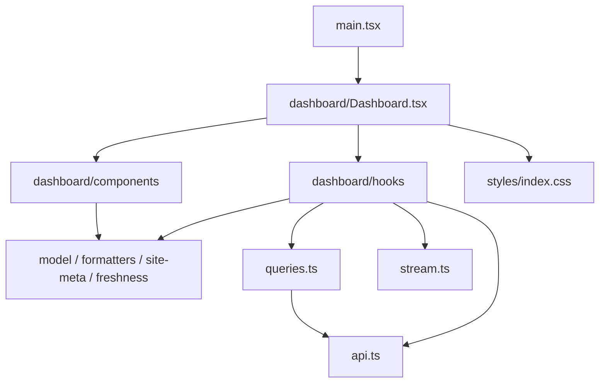
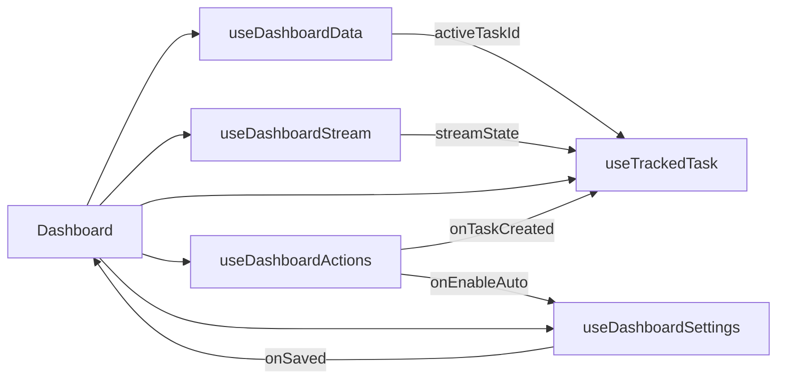

# Dashboard 实现设计

> 文档状态：当前实现说明（Step 19 后）
> 适用范围：`apps/web/src/dashboard` 的页面、Hooks、组件与样式模块
> 适用版本：单机 MVP，2026-09-19 代码基线
> 系统上下文：[前端设计总览](frontend-design.md)
> 视觉基线：[高保真可交互原型](design/high-fidelity/README.md)

## 1. 定位、事实源与维护规则

本文说明 Dashboard 当前的实现结构、模块职责和长期维护边界。系统级数据流与页面状态由[前端设计总览](frontend-design.md)维护；HTTP/SSE 精确契约以 [API 设计](api-design.md)、共享 Zod Schema 和服务端路由为准。

实现事实源如下：

| 内容 | 事实源 |
| --- | --- |
| 页面编排 | `apps/web/src/dashboard/Dashboard.tsx` |
| 业务状态与流程 | `apps/web/src/dashboard/hooks` |
| 组件 Props 与交互 | `apps/web/src/dashboard/components` |
| HTTP、Query 与 SSE 基础设施 | `apps/web/src/api.ts`、`queries.ts`、`stream.ts` |
| 页面纯函数与模型 | `apps/web/src/dashboard/formatters.ts`、`model.ts`、`site-meta.ts`、`freshness.ts` |
| 样式与响应式规则 | `apps/web/src/dashboard/styles` |

源码接口发生变化时，必须在同一变更中更新本文。本文不复制共享 DTO 的完整字段，避免产生第二份契约。

## 2. 设计决策来源

Step 19 之前，约 1,375 行的 `Dashboard.tsx` 同时承担七类查询、写操作、SSE、任务恢复、确认状态和全部功能区渲染；约 925 行的 `style.css` 也缺少职责边界。拆分后，页面按“编排入口、业务 Hook、展示组件、纯模块、分层样式”组织。

文件尺寸约束来自这次拆分经验，用于阻止职责重新聚合：`Dashboard.tsx` 不超过 250 行，单组件不超过 300 行，单 Hook 不超过 250 行。当前基线分别为 145 行、最大组件 236 行、最大 Hook 85 行。

## 3. 当前结构与依赖方向

```text
apps/web/src/
├── dashboard/
│   ├── Dashboard.tsx
│   ├── model.ts
│   ├── formatters.ts
│   ├── site-meta.ts
│   ├── components/
│   │   ├── DashboardHeader.tsx
│   │   ├── FeedbackBanners.tsx
│   │   ├── MonitoringStrip.tsx
│   │   ├── EntryCard.tsx
│   │   ├── SiteSection.tsx
│   │   ├── SiteCard.tsx
│   │   ├── CandidatePanel.tsx
│   │   ├── EventsPanel.tsx
│   │   ├── TaskPanel.tsx
│   │   ├── SettingsDrawer.tsx
│   │   ├── NumberField.tsx
│   │   └── ConfirmDialog.tsx
│   ├── hooks/
│   │   ├── useDashboardData.ts
│   │   ├── useDashboardStream.ts
│   │   ├── useTrackedTask.ts
│   │   ├── useDashboardActions.ts
│   │   └── useDashboardSettings.ts
│   └── styles/
│       ├── index.css
│       ├── foundation.css
│       ├── layout.css
│       ├── status.css
│       ├── sections.css
│       ├── overlays.css
│       └── responsive.css
├── api.ts
├── freshness.ts
├── queries.ts
├── stream.ts
└── main.tsx
```



依赖边界：

- `Dashboard` 依赖 Hooks 和 Components；Components 不依赖页面或业务 Hook。
- Hooks 可以依赖 `api.ts`、`queries.ts`、`stream.ts` 和纯模块；基础设施不反向导入 React 视图。
- 展示组件不直接调用 API、`QueryClient`、`sessionStorage` 或 `DashboardStream`。
- 跨组件 UI 类型放入 `model.ts`；仅属于单个组件的 Props 留在组件文件。
- Hooks 通过显式参数和回调协作，不使用 Context、全局可变状态或万能 `useDashboard()`。

## 4. 页面编排

`Dashboard` 调用五个 Hook，管理设置抽屉开关及触发按钮焦点引用，再按阅读顺序组合组件。它不直接实现请求、缓存、会话存储或 SSE 生命周期。

当前协作关系：



核心组合方式与当前接口一致：

```tsx
const data = useDashboardData();
const streamState = useDashboardStream();
const trackedTask = useTrackedTask({
  streamState,
  activeTaskId: data.activeTaskId,
});
const settings = useDashboardSettings({
  settings: data.settings,
  profileUid: data.snapshot?.profile?.uid ?? null,
  onSaved: closeSettings,
});
const actions = useDashboardActions({
  busy: trackedTask.busy,
  onTaskCreated: trackedTask.track,
  onEnableAuto: settings.enableAutoSwitch,
});
```

## 5. Hooks 设计

### 5.1 `useDashboardData()`

统一管理七类 Dashboard Query，并返回解包后的业务数据：

- `health`、`monitoring`、`snapshot`、`siteMap`、`diagnosis`、`events`、`settings`；
- `activeTaskId`、`directReachable` 等页面派生值；
- `now`、`lastSyncedAt`、`fetching`、`initialLoading`、`offline`、`partialError`；
- 无业务副作用的 `refresh()`。

`health` 失败被解释为后台不可达；七类 Query 的错误同时汇总为 `partialError`，并保留仍可用的缓存数据。该 Hook 不管理 SSE、任务、写操作或表单草稿。

### 5.2 `useDashboardStream()`

为当前 `QueryClient` 创建唯一 `DashboardStream`，挂载时订阅并启动，卸载时退订并停止。Hook 直接返回 `connecting | connected | offline` 状态字符串。

重连退避、通知合并、资源到 Query 的映射、15 秒降级同步和页面可见性校准均留在 `stream.ts`，Hook 只负责 React 生命周期接入。

### 5.3 `useTrackedTask({ streamState, activeTaskId })`

负责当前任务的恢复、接管、读取和清理，返回：

- `task`、`loading`、`error` 和综合繁忙状态 `busy`；
- `track(taskId)`：接管新任务并写入 `clash-sentinel.active-task-id`；
- `dismiss()`：关闭任务面板并清除会话记录。

它从 `sessionStorage` 恢复任务 ID，并接管监测快照报告的不同活动任务。SSE 在线时依赖失效通知；连接中或离线时，未终态任务每两秒轮询。任务进入终态后停止轮询，但只有用户关闭面板时才清除会话记录。

### 5.4 `useDashboardActions({ busy, onTaskCreated, onEnableAuto })`

负责五类手动操作、启用自动切换的确认流程、操作错误和焦点恢复，返回：

- 状态：`confirmation`、`error`、`submitting`；
- `request(action, ip?)`：提交直接操作，或为 `apply`、`reset`、`rollback` 建立确认模型；
- `requestEnableAuto()`：建立启用自动切换的确认模型；
- `confirm()`、`cancel()`：完成或取消当前确认，并恢复触发元素焦点；
- `clearError()`：清除操作错误。

服务端返回新 `taskId` 时调用 `onTaskCreated`；冲突错误包含 `activeTaskId` 时也接管已有任务。启用自动切换在确认后通过 `onEnableAuto` 交给设置 Hook，不在本 Hook 内复制设置保存逻辑。

### 5.5 `useDashboardSettings({ settings, profileUid, onSaved })`

负责完整设置保存及自动切换开关，返回：

- `save(settingsUpdate)`；
- `enableAutoSwitch()`、`disableAutoSwitch()`；
- `saving`、`autoSaving`、`error`、`resetError()`。

保存成功后更新 `settings` 缓存并精确使 `monitoring` Query 失效。完整设置保存还调用 `onSaved`，由页面关闭抽屉并恢复设置按钮焦点。表单草稿、单位换算和共享 Schema 校验属于 `SettingsDrawer`。

## 6. 组件职责

| 组件 | 职责 | 主要事件 |
| --- | --- | --- |
| `DashboardHeader` | 品牌、连接状态、同步时间、刷新和设置入口 | `onRefresh`、`onOpenSettings` |
| `FeedbackBanners` | 首次加载、后台离线、SSE 降级、部分错误和操作错误 | 无 |
| `MonitoringStrip` | 调度启停、阶段、检测间隔和时间 | 无 |
| `EntryCard` | 当前入口、锁定、失败、冷却和四个主操作 | `onAction` |
| `SiteSection` | 国内/代理分区标题、统计和卡片网格 | 无 |
| `SiteCard` | 单站状态、耗时和 OpenAI 附加服务状态 | 无 |
| `CandidatePanel` | 诊断有效期、候选列表与应用入口 | `onApply` |
| `EventsPanel` | 最近八条事件 | 无 |
| `TaskPanel` | 任务阶段、结果、恢复结论和关闭入口 | `onClose` |
| `SettingsDrawer` | 表单草稿、单位换算、校验、Escape 和遮罩关闭 | `onSave`、`onAutoChange`、`onClose` |
| `NumberField` | 数字输入和单位布局 | 标准值变更回调 |
| `ConfirmDialog` | 风险说明、初始焦点、Escape 和确认/取消 | `onConfirm`、`onCancel` |

组件只接收已整理的数据和具名回调，不接收完整 Hook 返回对象或 TanStack Query 对象。`SettingsDrawer` 是唯一持有设置草稿的组件；`ConfirmDialog` 保证初始焦点和 Escape 行为，操作 Hook 负责关闭后的触发元素焦点恢复。

## 7. 纯模块与样式分层

- `model.ts`：保存 `Confirmation` 等跨组件 UI 模型，不复制共享领域类型。
- `formatters.ts`：提供时间、日期、健康色调、安全错误摘要和任务展示映射等纯函数。
- `site-meta.ts`：维护六个站点的名称、图标、分组和稳定显示顺序。
- `freshness.ts`：维护候选报告有效期算法。

`styles/index.css` 按固定顺序导入样式，避免层叠关系随模块引用变化：

1. `foundation.css`：变量、重置、字体、按钮和通用面板；
2. `layout.css`：应用壳、顶栏、工作区和通用网格；
3. `status.css`：状态 pill、banner、连接和错误表达；
4. `sections.css`：监测、入口、站点、候选、事件和任务；
5. `overlays.css`：设置抽屉、遮罩和确认框；
6. `responsive.css`：900px、620px 和 reduced-motion 规则。

新增或移动选择器时必须保持导入顺序和特异性可解释；视觉调整需同时通过断点检查。

## 8. 测试覆盖与变更验收

当前测试覆盖纯格式化、设置表单、确认框、反馈状态、任务展示、数据读取、SSE 生命周期、任务恢复与接管、操作冲突和设置缓存更新。DOM 测试使用文件级 jsdom 环境；API、Query、SSE 和候选时效测试继续运行在 Node 环境。

未来修改应按影响范围验证：

- 修改纯模块：覆盖空值、非法时间、未知错误、Request ID 和健康状态映射。
- 修改组件：覆盖校验、确认/取消、Escape、初始焦点、焦点恢复、ARIA 和错误保留。
- 修改 Hook：覆盖任务恢复与终态、SSE/轮询切换、冲突接管、缓存更新和失败路径。
- 修改布局或样式：执行 Playwright，并在 1440px、390px 及 900px、620px 断点两侧复核。
- 所有前端变更至少执行 `npm run format:check`、`npm run lint`、`npm run typecheck`、`npm test` 和 `npm run build`；交互或视觉变更还需执行 `npm run test:e2e`。

长期结构验收要求：

- `Dashboard.tsx` 不超过 250 行，单组件不超过 300 行，单 Hook 不超过 250 行；
- 展示组件不直接访问 API、`QueryClient`、会话存储或 `DashboardStream`；
- 用户可见文案、确认条件、键盘路径、焦点恢复、ARIA 和响应式行为的变更必须有对应测试或视觉证据；
- 公共 API、共享 Schema 或 Query/SSE 语义变化必须同步更新对应事实源文档。
