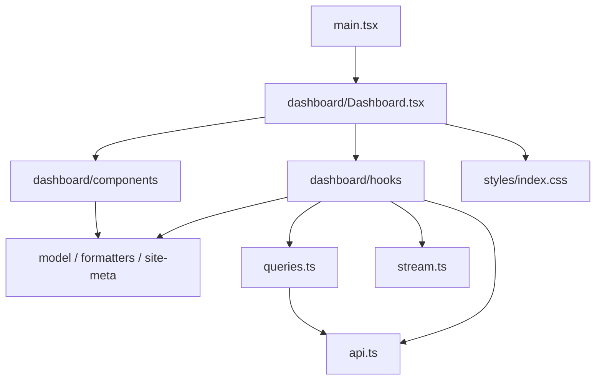
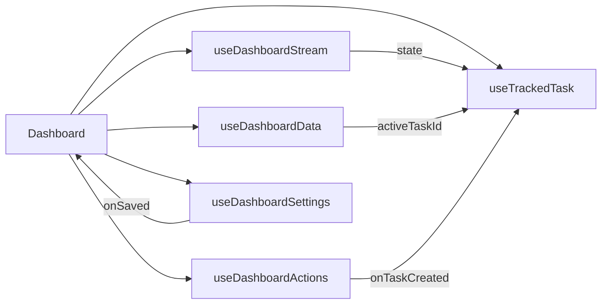

# Dashboard 重构设计

> 文档状态：**已实现（Step 19）**
> 适用范围：`apps/web/src/dashboard` 的页面、Hooks、组件与样式模块
> 现状与行为基线：[前端设计总览](frontend-design.md)  
> 视觉基线：[高保真可交互原型](design/high-fidelity/README.md)

## 1. 目标与非目标

重构前的 `Dashboard.tsx` 约 1,375 行，同时承担功能区渲染、七类查询、三类 Mutation、SSE 生命周期、任务恢复、确认与焦点状态；单体 `style.css` 约 925 行。Step 19 已按本文方案完成拆分，当前页面入口为 145 行，最大组件 236 行，最大 Hook 85 行。

Step 19 的目标是按“页面编排、业务 Hook、展示组件、纯函数、样式模块”彻底拆分，使每个文件只有一个清晰变化原因，并为状态流程增加 DOM 与 Hook 测试。

本重构不得修改：

- 公共 API、共享 Schema、数据库或服务端行为；
- Query Key、请求超时、SSE 事件及重连/降级参数；
- 用户可见功能、文字、确认条件、任务语义和读取无副作用约束；
- DOM 语义、焦点路径、响应式断点、视觉层级和品牌资源。

## 2. 目标结构与依赖方向

当前实现结构：

```text
apps/web/src/
├── dashboard/
│   ├── Dashboard.tsx
│   ├── model.ts
│   ├── formatters.ts
│   ├── site-meta.ts
│   ├── components/
│   │   ├── DashboardHeader.tsx
│   │   ├── FeedbackBanners.tsx
│   │   ├── MonitoringStrip.tsx
│   │   ├── EntryCard.tsx
│   │   ├── SiteSection.tsx
│   │   ├── SiteCard.tsx
│   │   ├── CandidatePanel.tsx
│   │   ├── EventsPanel.tsx
│   │   ├── TaskPanel.tsx
│   │   ├── SettingsDrawer.tsx
│   │   ├── NumberField.tsx
│   │   └── ConfirmDialog.tsx
│   ├── hooks/
│   │   ├── useDashboardData.ts
│   │   ├── useDashboardStream.ts
│   │   ├── useTrackedTask.ts
│   │   ├── useDashboardActions.ts
│   │   └── useDashboardSettings.ts
│   └── styles/
│       ├── index.css
│       ├── foundation.css
│       ├── layout.css
│       ├── status.css
│       ├── sections.css
│       ├── overlays.css
│       └── responsive.css
├── api.ts
├── freshness.ts
├── queries.ts
├── stream.ts
└── main.tsx
```



依赖只允许向下：

- `Dashboard` 可以依赖 Hooks 和 Components；Components 不能依赖页面或业务 Hook。
- Hooks 可以依赖 `api.ts`、`queries.ts`、`stream.ts` 和纯模块；基础设施不得反向导入 React 视图。
- 展示组件不得直接调用 API、`QueryClient`、`sessionStorage` 或 `DashboardStream`。
- 组件间共享的 UI 类型放入 `model.ts`；只属于一个组件的 Props 保留在组件文件。
- 不创建包含全部查询、Mutation 和视图状态的万能 `useDashboard()`。

## 3. 页面编排与组件拆分

### 3.1 `Dashboard`

`Dashboard` 只负责调用五个 Hook、连接显式回调、组织页面阅读顺序及控制设置抽屉的开关。目标不超过 250 行，不直接包含请求、缓存、存储或 SSE 实现。

示意协作：

```tsx
const data = useDashboardData();
const stream = useDashboardStream();
const task = useTrackedTask({ streamState: stream.state });
const actions = useDashboardActions({
  busy: task.busy,
  onTaskCreated: task.track,
});
const settings = useDashboardSettings();
```

这只是职责接口，不要求逐字采用示例字段；实现时应优先使用具名字段和方法，避免返回巨型不透明对象。

### 3.2 展示组件

| 组件 | 职责 | 主要输入/事件 |
| --- | --- | --- |
| `DashboardHeader` | 品牌、连接状态、同步时间、刷新和设置入口 | 流状态、离线、刷新状态；`onRefresh`、`onOpenSettings` |
| `FeedbackBanners` | 首次加载、后台离线、SSE 降级、部分错误和操作错误 | 已整理的展示状态；不得解析 Query |
| `MonitoringStrip` | 调度启停、阶段、检测间隔和时间 | `MonitoringSnapshot`、`Settings` |
| `EntryCard` | 当前入口、锁定、失败、冷却和四个主操作 | 快照、设置、离线、繁忙；具名操作回调 |
| `SiteSection` | 国内/代理分区标题、统计和卡片网格 | 分组、结果、离线 |
| `SiteCard` | 单站状态、耗时和 OpenAI 附加服务状态 | 站点元数据、结果、离线 |
| `CandidatePanel` | 诊断有效期、候选列表与应用入口 | 诊断、当前 IP、时间、繁忙；`onApply` |
| `EventsPanel` | 最近八条事件 | 事件数组 |
| `TaskPanel` | 任务阶段、结果、恢复结论和关闭入口 | 任务、读取状态；`onDismiss` |
| `SettingsDrawer` | 表单草稿、字段校验、Escape/遮罩关闭 | 设置与提交状态；`onSave`、`onAutoChange`、`onClose` |
| `NumberField` | 数字输入和单位布局 | HTML 数字约束与值变更 |
| `ConfirmDialog` | 风险说明、初始焦点、Escape 和确认/取消 | 确认模型、只读上下文；`onConfirm`、`onCancel` |

单个组件目标不超过 300 行。组件 Props 应按功能命名，不得把整个 Hook 返回值或 Query 对象直接传入。

## 4. Hooks 设计

以下 Hooks 均已实现。

### 4.1 `useDashboardData`

统一调用七类 Dashboard Query，并返回：

- 各业务快照的已解析 `data`，不向组件暴露 API 响应包和 Query 对象；
- `initialLoading`、`fetching`、`offline`、`hasPartialError` 和安全错误摘要；
- 国内站点可达数量、站点分组等只依赖快照的页面派生值；
- 最近一次七类读取均无错误且停止 fetching 的同步时间；
- `refresh()`：更新时间基准并调用只读 `refreshDashboard()`。

它不管理 SSE、任务、写操作、设置草稿或确认框。健康探针失败是后台离线；其他 Query 失败是部分失败，必须保留其余缓存数据。

### 4.2 `useDashboardStream`

负责为当前 `QueryClient` 创建唯一 `DashboardStream`，在挂载时订阅并启动、卸载时退订并停止，返回 `connecting | connected | offline`。

重连延迟、通知合并、Query 映射、15 秒降级同步和可见性校准继续留在 `stream.ts`；Hook 不复制这些算法。

### 4.3 `useTrackedTask`

负责：

- 从 `sessionStorage` 的 `clash-sentinel.active-task-id` 初始化任务 ID；
- 调用任务 Query，并根据流状态使用既有 `taskPollingInterval`；
- 接收监测快照中的 `activeTaskId` 并接管不同的活动任务；
- 暴露 `track(taskId)`、`dismiss()`、任务数据、读取状态和 `busy`；
- `track` 同步写入会话存储，`dismiss` 同步清除；终态不自动清除。

Hook 必须容忍无任务、刷新恢复、SSE 在线、SSE 离线和任务读取失败。会话存储只保存任务 ID。

### 4.4 `useDashboardActions`

负责五类手动操作、操作错误和危险操作确认。对外优先暴露具名方法：

- `runHealthCheck()`、`runDiagnosis()`；
- `requestApply(ip)`、`requestReset()`、`requestRollback()`；
- `confirm()`、`cancelConfirmation()`、`clearError()`。

直接操作立即提交；配置操作先保存当前焦点和 `Confirmation`。成功时调用注入的 `onTaskCreated(taskId)`；服务端冲突包含 `activeTaskId` 时同样调用该回调，并显示“已切换到该任务”。取消或确认关闭对话框后恢复触发元素焦点。

该 Hook 不查询任务，不管理设置 Mutation，也不判断候选是否可应用；视图禁用条件来自已计算的业务状态。

### 4.5 `useDashboardSettings`

负责完整设置保存与自动切换保存，返回提交状态、安全错误和具名方法：

- `save(settingsUpdate)`；
- `disableAutoSwitch()`；
- `enableAutoSwitch()`，使用当前设置与当前 profile UID 构造更新；
- `resetError()`。

保存成功后更新 `settings` 缓存并精确使 `monitoring` 失效。完整设置保存通过 `onSaved` 通知页面关闭抽屉并恢复焦点。启用动作由页面/确认框调用，禁用可直接调用。表单草稿和共享 Schema 校验留在 `SettingsDrawer`。

### 4.6 Hook 协作



React Hook 必须只在组件或自定义 Hook 顶层调用。Hook 之间通过参数和回调组合，不在事件回调中临时调用另一个 Hook，也不引入全局可变状态。

## 5. 纯模块与样式

- `model.ts`：`Confirmation` 等跨组件 UI 模型，不复制共享领域类型。
- `formatters.ts`：时间、日期、健康色调、API 错误和任务展示文案；函数保持纯净并补边界测试。
- `site-meta.ts`：六站名称、图标和 direct/proxy 分组，以及稳定目标顺序。
- `freshness.ts`：继续独立维护候选报告有效期，不并入组件。

CSS 迁移时先保持原选择器不变，按原出现顺序移入：

1. `foundation.css`：变量、重置、字体、按钮与通用面板；
2. `layout.css`：应用壳、顶栏、工作区和通用网格；
3. `status.css`：状态 pill、banner、连接与错误表达；
4. `sections.css`：监测、入口、站点、候选、事件和任务；
5. `overlays.css`：设置抽屉、遮罩和确认框；
6. `responsive.css`：900px、620px 与 reduced-motion；
7. `index.css`：只按上述固定顺序导入。

不得在拆分期间顺便改名或重新设计，以避免层叠顺序和视觉回归同时发生。

## 6. 实施顺序

1. 提取 `model.ts`、`formatters.ts`、`site-meta.ts`，补纯函数测试。
2. 拆分无状态展示组件，保持 `Dashboard` 继续提供原有数据与回调。
3. 拆分 `SettingsDrawer`、`NumberField` 和 `ConfirmDialog`，增加 DOM 测试。
4. 依次提取数据、流、任务、操作和设置 Hooks；每次只迁移一个状态所有者。
5. 将 `Dashboard.tsx` 收敛为编排入口，更新 `main.tsx` 导入。
6. 按固定导入顺序拆分 CSS，执行桌面与窄屏视觉比对。
7. 删除旧 `apps/web/src/Dashboard.tsx`、`style.css` 中已迁移内容；确认没有双份实现。
8. 更新[前端设计总览](frontend-design.md)的实现路径和限制。

每一步都应保持可构建、可测试，避免一次性搬迁全部状态后再修复。

## 7. 测试与验收

Step 19 已增加 `@testing-library/react`、`@testing-library/user-event`、`@testing-library/jest-dom` 和 `jsdom`。DOM 测试通过文件级声明使用 jsdom，现有 API、Query、SSE 和候选时效测试继续运行在 Node 环境。

必须覆盖：

- 设置草稿初始化、单位转换、共享 Schema 校验和错误提示；
- 启用自动切换确认、关闭自动切换直提、危险操作确认与取消；
- 对话框初始焦点、Escape、取消/确认后的焦点恢复；
- 任务 ID 会话恢复、活动任务接管、冲突接管、终态停止轮询和手动清除；
- SSE 状态接入及卸载资源释放；
- 初次加载、后台离线、流离线、部分错误和操作错误 banner；
- 站点 stale、候选过期和任务恢复结论；
- 设置成功后的缓存更新、监测失效、抽屉关闭和失败保留。

验收指标：

- `Dashboard.tsx` 不超过 250 行，单组件不超过 300 行，单 Hook 不超过 250 行；
- 页面组件不直接访问 API、QueryClient、会话存储或 `DashboardStream`；
- 现有 API、Query、SSE、候选时效单元测试及 Playwright 场景全部通过；
- 1440px、390px 视觉与原型基准一致，并在 900px、620px 断点两侧无布局回归；
- 键盘、焦点、ARIA、确认文案和错误 Request ID 展示不变；
- `npm run format:check`、`npm run lint`、`npm run typecheck`、`npm test`、`npm run build`、`npm run test:e2e` 和 `git diff --check` 全部通过。
