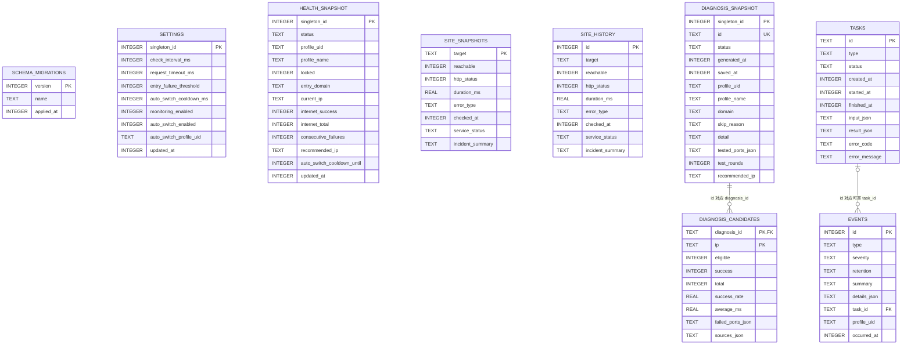
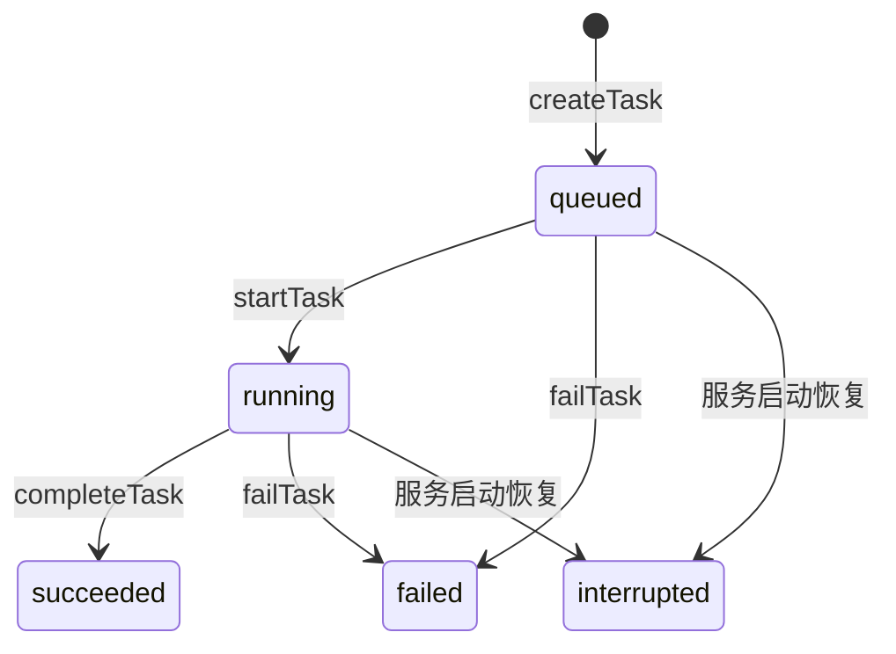

# Clash Sentinel 数据库设计

状态：已实现的 SQLite 存储专题，最近于 2026-09-18（Step 17）按迁移与仓储实现核对。

本文说明本地 SQLite 数据结构、约束、事务和维护规则。系统上下文和跨模块数据流见
[服务端设计总览](server-design.md)。数据库结构以
[`migrations.ts`](../apps/server/src/storage/migrations.ts) 为最终事实，数据访问行为以
`storage/` 下的六个领域仓储为最终事实。修改迁移、仓储映射、事务或保留规则时，必须在同一个
变更中更新本文。

## 1. 设计目标与边界

本地存储负责保存用户策略、当前健康状态、站点探测历史、最近一次诊断、任务和事件，使服务
重启后可以恢复业务上下文。它不保存 Legacy Shell 生成的原始 TSV、Clash 配置正文、订阅正文、
Mihomo 控制器密钥、报告路径或备份路径。

存储层由四部分组成：

1. `packages/shared` 中的 Zod Schema 定义领域对象并执行运行时校验。
2. `SqliteConnection` 管理连接、迁移和事务，六个领域仓储分别完成字段映射、校验与清理。
3. `SqliteStore` 组合共享连接和六个仓储，不提供跨领域的数据访问转发方法。
4. SQLite 使用类型、`NOT NULL`、`CHECK`、主键和外键保护落盘数据。

当前数据库包含 1 张迁移元数据表和 8 张业务表：

| 分类 | 表 |
| --- | --- |
| 迁移 | `schema_migrations` |
| 策略与当前状态 | `settings`、`health_snapshot`、`site_snapshots` |
| 历史与诊断 | `site_history`、`diagnosis_snapshot`、`diagnosis_candidates` |
| 任务与审计 | `tasks`、`events` |

## 2. 数据库文件与连接

### 2.1 路径优先级

数据库路径按以下顺序确定，命中后不再读取后续来源：

1. `new SqliteStore({ databasePath })` 构造参数。
2. `CLASH_SENTINEL_DB_PATH` 环境变量。
3. `<project-root>/.state/clash-sentinel.db` 默认路径；项目根目录由服务端模块位置推导，不依赖进程当前目录。

相对路径会通过 `path.resolve()` 转换为绝对路径。文件型数据库的父目录会以 `0700` 权限递归
创建；测试显式传入临时路径，也可以使用 `:memory:` 创建内存数据库。

SQLite 在 WAL 模式下可能同时存在以下文件：

| 文件 | 用途 |
| --- | --- |
| `clash-sentinel.db` | 主数据库文件 |
| `clash-sentinel.db-wal` | 尚未 checkpoint 回主文件的预写日志 |
| `clash-sentinel.db-shm` | WAL 连接之间共享的索引和协调信息 |

这三个文件属于同一个数据库。复制正在使用的数据库时不能只假设主文件包含全部最新数据，
应先安全关闭连接或使用 SQLite 备份机制。现有 `.gitignore` 通过 `*.db`、`*.db-*`、
`*.sqlite*` 和 `.state/` 排除数据库及其伴随文件。

### 2.2 连接初始化

`SqliteConnection` 打开连接后依次设置：

| 设置 | 当前值 | 作用 |
| --- | --- | --- |
| `foreign_keys` | `ON` | 启用外键检查、级联删除和置空规则 |
| `journal_mode` | `WAL` | 使用预写日志，提高短事务下读写并存和异常恢复能力 |
| `busy_timeout` | `5000` | 数据库遇到短暂锁竞争时最多等待 5000 毫秒 |
| `synchronous` | `NORMAL` | 在 WAL 模式下平衡本机应用的持久性与写入性能 |

随后执行版本化迁移；设置仓储补充缺失的默认策略。runtime 在其他服务可用前单独执行任务恢复，
并在同一事务中协调任务、自动切换设置和关键事件。持有 `SqliteStore` 的服务必须在退出时调用
`close()`，释放数据库文件句柄并完成安全关闭。

### 2.3 领域仓储访问

`SqliteStore` 只公开六个仓储以及 `transaction()`、`close()`。业务服务通过 `Pick<Repository, ...>`
声明必要的方法，不依赖完整组合根。例如设置和任务分别通过 `store.settings.getSettings()`、
`store.tasks.createTask()` 访问；跨仓储的启动恢复由 runtime 使用 `store.transaction()` 协调。

## 3. 实体关系



图中只有两组真实外键：

- `diagnosis_candidates.diagnosis_id` 引用 `diagnosis_snapshot.id`；一条诊断拥有零到多个候选，
  删除诊断时通过 `ON DELETE CASCADE` 自动删除其候选。
- `events.task_id` 可选引用 `tasks.id`；删除任务时通过 `ON DELETE SET NULL` 保留事件并清除关联。

`site_snapshots` 与 `site_history` 都使用相同的固定 `target` 枚举，但二者没有外键。当前快照
会被覆盖，历史记录会追加和清理，不能让某条历史依赖一条持续变化的快照记录。

`settings`、`health_snapshot` 和 `diagnosis_snapshot` 是互相独立的单例表，彼此没有外键。

## 4. 通用存储约定

### 4.1 单例表

单例表使用以下组合：

```sql
singleton_id INTEGER PRIMARY KEY CHECK (singleton_id = 1)
```

`CHECK` 规定唯一允许的值是 `1`，主键又不允许两个相同的 `1`，因此表中只能有零行或一行。
读取当前记录时固定查询：

```sql
SELECT *
FROM diagnosis_snapshot
WHERE singleton_id = 1;
```

`diagnosis_snapshot.singleton_id` 只负责“最近诊断最多一条”；其 `id` 是每次诊断新生成的 UUID，
用于区分具体诊断并供候选表引用。两者不能互相替代。

### 4.2 布尔值

SQLite 中的布尔值统一保存为带约束的整数：

```sql
INTEGER NOT NULL CHECK (column_name IN (0, 1))
```

写入时通过 `Number(boolean)` 转成 `0/1`，读取时通过 `Boolean(value)` 转回 TypeScript 布尔值。

### 4.3 时间

所有时间在 SQLite 中保存为 Unix 毫秒 `INTEGER`，便于排序、范围查询和重启恢复；领域对象使用
ISO 8601 字符串，例如 `2026-09-08T04:00:00.000Z`。`toEpoch()` 在写入时转换并拒绝非法时间，
`fromEpoch()` 在读取时转换回 ISO 8601。

### 4.4 JSON 文本

SQLite 的 `TEXT` 用于保存少量数组和扩展对象：

- `tested_ports_json`：诊断测试端口数组。
- `failed_ports_json`：候选失败端口数组。
- `sources_json`：候选来源数组。
- `input_json`、`result_json`：任务脱敏输入与结果。
- `details_json`：事件脱敏详情。

固定诊断数组来自受控领域 Schema，直接使用 `JSON.stringify()` 和 `JSON.parse()`；任务和事件的
开放扩展对象还必须通过递归脱敏及 32 KiB 大小限制。

### 4.5 三层校验

数据写入和读取遵循三层防线：

```text
不可信输入或数据库行
        ↓
Zod：校验领域结构、枚举、IPv4 和跨字段规则
        ↓
领域仓储：转换时间、布尔值和 JSON，限制状态转换与领域事务边界
        ↓
SQLite：执行 NOT NULL、CHECK、主键、唯一键和外键约束
```

从数据库读取后仍会再次通过共享 Schema，避免损坏或不兼容数据悄悄进入业务层。

## 5. 表结构字典

### 5.1 `schema_migrations`

记录已成功应用的迁移，由迁移执行器管理。

| 字段 | 类型 | 可空 | 键/约束 | 含义 |
| --- | --- | --- | --- | --- |
| `version` | `INTEGER` | 否 | 主键 | 单调递增且不可复用的迁移版本 |
| `name` | `TEXT` | 否 |  | 稳定迁移名称 |
| `applied_at` | `INTEGER` | 否 |  | 成功应用时间，Unix 毫秒 |

### 5.2 `settings`

保存当前用户策略，固定为 `singleton_id = 1` 的单例行。

| 字段 | 类型 | 可空 | 键/约束 | 含义 |
| --- | --- | --- | --- | --- |
| `singleton_id` | `INTEGER` | 否 | 主键；只能为 `1` | 单例标识 |
| `check_interval_ms` | `INTEGER` | 否 | `1000..86400000` | 检测间隔，毫秒 |
| `request_timeout_ms` | `INTEGER` | 否 | `100..60000` | 单次请求超时，毫秒 |
| `entry_failure_threshold` | `INTEGER` | 否 | `1..100` | 触发严格诊断前的连续入口失败阈值 |
| `auto_switch_cooldown_ms` | `INTEGER` | 否 | `0..86400000` | 自动处理冷却时长，毫秒 |
| `monitoring_enabled` | `INTEGER` | 否 | `0/1` | 是否启用监测 |
| `auto_switch_enabled` | `INTEGER` | 否 | `0/1` | 是否启用自动切换 |
| `auto_switch_profile_uid` | `TEXT` | 是 | 自动切换开启时必须非空 | 自动切换绑定的订阅 UID |
| `updated_at` | `INTEGER` | 否 |  | 策略更新时间，Unix 毫秒 |

首次打开数据库时使用 `INSERT OR IGNORE` 写入默认值：检测间隔 60 秒、请求超时 5 秒、失败阈值
3 次、冷却 5 分钟、监测开启、自动切换关闭且未绑定订阅。
自动切换开启时绑定当前健康快照的订阅 UID；恢复失败、恢复状态未知、订阅 UID 变化或自动任务被服务重启中断时，服务会关闭开关并清空该 UID。

### 5.3 `health_snapshot`

保存当前综合健康状态，固定为 `singleton_id = 1` 的单例行。

| 字段 | 类型 | 可空 | 键/约束 | 含义 |
| --- | --- | --- | --- | --- |
| `singleton_id` | `INTEGER` | 否 | 主键；只能为 `1` | 单例标识 |
| `status` | `TEXT` | 否 | 综合健康枚举 | 当前综合状态 |
| `profile_uid` | `TEXT` | 是 | 有名称时 UID 必须存在 | 当前订阅 UID |
| `profile_name` | `TEXT` | 是 | UID 为空时必须为空 | 当前订阅显示名 |
| `locked` | `INTEGER` | 否 | `0/1` | 入口是否已受管锁定 |
| `entry_domain` | `TEXT` | 是 | 锁定时必填，未锁定时必须为空 | 入口域名 |
| `current_ip` | `TEXT` | 是 | 锁定时必填，未锁定时必须为空 | 当前锁定 IPv4 |
| `internet_success` | `INTEGER` | 是 | 非负；与总数同时为空或存在 | 国内互联网成功数 |
| `internet_total` | `INTEGER` | 是 | 正数；成功数不得超过总数 | 国内互联网探测总数 |
| `consecutive_failures` | `INTEGER` | 否 | 非负 | 入口连续失败次数 |
| `recommended_ip` | `TEXT` | 是 | 领域层校验 IPv4 | 最近推荐 IP |
| `auto_switch_cooldown_until` | `INTEGER` | 是 |  | 自动切换冷却截止时间，Unix 毫秒 |
| `updated_at` | `INTEGER` | 否 |  | 快照更新时间，Unix 毫秒 |

`status` 允许 `healthy`、`internet_uncertain`、`internet_down`、`entry_suspected`、
`entry_down`、`proxy_error` 和 `unknown`。

### 5.4 `site_snapshots`

每个站点目标保存一条当前结果，`target` 本身是主键。

| 字段 | 类型 | 可空 | 键/约束 | 含义 |
| --- | --- | --- | --- | --- |
| `target` | `TEXT` | 否 | 主键；固定目标枚举 | 站点标识 |
| `reachable` | `INTEGER` | 否 | `0/1` | 是否可达 |
| `http_status` | `INTEGER` | 是 | `100..599`；不可达时必须为空 | HTTP 状态码 |
| `duration_ms` | `REAL` | 是 | 非负；不可达时必须为空 | HTTP 总耗时，毫秒 |
| `error_type` | `TEXT` | 是 | 错误枚举；可达时必须为空 | 探测失败分类 |
| `checked_at` | `INTEGER` | 否 |  | 检测时间，Unix 毫秒 |
| `service_status` | `TEXT` | 是 | 官方状态枚举；仅 OpenAI 状态目标允许 | 官方总体状态 |
| `incident_summary` | `TEXT` | 是 | 仅 OpenAI 状态目标允许 | 当前事故摘要 |

目标枚举为 `baidu`、`taobao`、`tencent`、`google`、`github`、`openai_status`。错误枚举为
`dns`、`timeout`、`connection`、`tls`、`http`、`proxy`、`parse`、`unknown`。官方状态枚举为
`operational`、`degraded`、`partial_outage`、`major_outage`、`maintenance`、`unknown`。

### 5.5 `site_history`

追加每次站点结果。字段语义和约束与 `site_snapshots` 相同，额外使用自增历史 ID。

| 字段 | 类型 | 可空 | 键/约束 | 含义 |
| --- | --- | --- | --- | --- |
| `id` | `INTEGER` | 否 | 自增主键 | 历史记录 ID |
| `target` | `TEXT` | 否 | 固定目标枚举 | 站点标识 |
| `reachable` | `INTEGER` | 否 | `0/1` | 是否可达 |
| `http_status` | `INTEGER` | 是 | `100..599`；不可达时必须为空 | HTTP 状态码 |
| `duration_ms` | `REAL` | 是 | 非负；不可达时必须为空 | HTTP 总耗时，毫秒 |
| `error_type` | `TEXT` | 是 | 错误枚举；可达时必须为空 | 探测失败分类 |
| `checked_at` | `INTEGER` | 否 |  | 检测时间，Unix 毫秒 |
| `service_status` | `TEXT` | 是 | 仅 OpenAI 状态目标允许 | 官方总体状态 |
| `incident_summary` | `TEXT` | 是 | 仅 OpenAI 状态目标允许 | 当前事故摘要 |

索引 `site_history_target_checked_idx(target, checked_at DESC, id DESC)` 支持按站点查询最新历史，
并用 `id` 对相同检测时间稳定排序。

### 5.6 `diagnosis_snapshot`

保存最近一次脱敏诊断，固定为 `singleton_id = 1` 的单例行。

| 字段 | 类型 | 可空 | 键/约束 | 含义 |
| --- | --- | --- | --- | --- |
| `singleton_id` | `INTEGER` | 否 | 主键；只能为 `1` | 最近诊断单例标识 |
| `id` | `TEXT` | 否 | 唯一；UUID | 本次诊断身份，供候选外键引用 |
| `status` | `TEXT` | 否 | `testable/skipped` | 是否产生可测试候选 |
| `generated_at` | `INTEGER` | 否 |  | Legacy 报告生成时间，Unix 毫秒 |
| `saved_at` | `INTEGER` | 否 |  | 诊断写入 SQLite 的时间，Unix 毫秒 |
| `profile_uid` | `TEXT` | 否 |  | 脱敏订阅 UID |
| `profile_name` | `TEXT` | 否 |  | 订阅显示名 |
| `domain` | `TEXT` | 是 |  | 单入口域名 |
| `skip_reason` | `TEXT` | 是 | 领域层校验固定枚举 | 跳过诊断原因 |
| `detail` | `TEXT` | 是 |  | 固定、脱敏的诊断说明 |
| `tested_ports_json` | `TEXT` | 否 | JSON 数组 | 严格诊断测试端口 |
| `test_rounds` | `INTEGER` | 否 | 大于 `0` | 每个候选测试轮数 |
| `recommended_ip` | `TEXT` | 是 | 领域层校验 IPv4 | 推荐的合格候选 |

### 5.7 `diagnosis_candidates`

保存最近诊断的候选列表。

| 字段 | 类型 | 可空 | 键/约束 | 含义 |
| --- | --- | --- | --- | --- |
| `diagnosis_id` | `TEXT` | 否 | 联合主键；外键引用 `diagnosis_snapshot.id` | 所属诊断 UUID |
| `ip` | `TEXT` | 否 | 联合主键；领域层校验 IPv4 | 候选 IPv4 |
| `eligible` | `INTEGER` | 否 | `0/1` | 是否满足应用条件 |
| `success` | `INTEGER` | 否 | 非负 | 成功探测次数 |
| `total` | `INTEGER` | 否 | 大于 `0` | 总探测次数 |
| `success_rate` | `REAL` | 否 | `0..100` | 成功率百分比 |
| `average_ms` | `REAL` | 否 | 非负 | 成功探测平均耗时，毫秒 |
| `failed_ports_json` | `TEXT` | 否 | JSON 数组 | 未通过的端口 |
| `sources_json` | `TEXT` | 否 | JSON 数组 | DNS 候选来源摘要 |

联合主键 `(diagnosis_id, ip)` 防止同一次诊断重复保存同一个 IP。外键使用
`ON DELETE CASCADE`，删除旧诊断时自动删除全部旧候选。

### 5.8 `tasks`

保存后台长操作的生命周期和脱敏结果。

| 字段 | 类型 | 可空 | 键/约束 | 含义 |
| --- | --- | --- | --- | --- |
| `id` | `TEXT` | 否 | 主键；UUID | 任务 ID |
| `type` | `TEXT` | 否 | 固定任务类型枚举 | 任务类型 |
| `status` | `TEXT` | 否 | 固定状态枚举 | 当前任务状态 |
| `created_at` | `INTEGER` | 否 |  | 创建时间，Unix 毫秒 |
| `started_at` | `INTEGER` | 是 |  | 开始时间，Unix 毫秒 |
| `finished_at` | `INTEGER` | 是 | 终态必须存在，非终态必须为空 | 结束时间，Unix 毫秒 |
| `input_json` | `TEXT` | 是 | 脱敏且不超过 32 KiB | 任务输入摘要 |
| `result_json` | `TEXT` | 是 | 脱敏且不超过 32 KiB | 任务结果摘要 |
| `error_code` | `TEXT` | 是 | 存储方法限制为最多 100 字符 | 稳定错误码 |
| `error_message` | `TEXT` | 是 | 脱敏且最多 2000 字符 | 面向调用方的错误说明 |
| `recovery_status` | `TEXT` | 是 | `not_required/recovered/recovery_failed/unknown` | 配置动作失败后的恢复结论 |

任务类型为 `health_check`、`diagnose`、`apply`、`reset`、`rollback`、`auto_switch`；状态为
`queued`、`running`、`succeeded`、`failed`、`interrupted`。索引
`tasks_created_idx(created_at DESC)` 支持按创建时间读取最近任务。

`health_check` 记录对应通过动作接口发起的手动健康检查。定时健康检查由 `TaskEngine` 以瞬时根任务执行，继续保存健康快照、站点结果和状态迁移事件，但不在 `tasks` 中创建、更新或保留根任务记录。定时检查满足自动切换条件时生成的 `auto_switch` 仍写入本表，并遵循相同的任务状态转换、恢复状态和配置动作审计规则。

### 5.9 `events`

保存用户可见事件和必要审计摘要。

| 字段 | 类型 | 可空 | 键/约束 | 含义 |
| --- | --- | --- | --- | --- |
| `id` | `INTEGER` | 否 | 自增主键 | 事件 ID |
| `type` | `TEXT` | 否 | 领域层限制 1 至 100 字符 | 稳定事件类型 |
| `severity` | `TEXT` | 否 | `info/warning/error/critical` | 严重级别 |
| `retention` | `TEXT` | 否 | `ordinary/critical` | 历史保留分类 |
| `summary` | `TEXT` | 否 | 脱敏；领域层限制 1 至 2000 字符 | 简短事件摘要 |
| `details_json` | `TEXT` | 是 | 脱敏且不超过 32 KiB | 结构化事件详情 |
| `task_id` | `TEXT` | 是 | 外键引用 `tasks.id`；删除任务时置空 | 可选关联任务 |
| `profile_uid` | `TEXT` | 是 |  | 可选关联订阅 UID |
| `occurred_at` | `INTEGER` | 否 |  | 事件发生时间，Unix 毫秒 |

`severity` 表示影响程度，`retention` 决定历史数量上限，两者含义独立。索引
`events_retention_time_idx(retention, occurred_at DESC, id DESC)` 支持分类清理和稳定排序。

## 6. 主要数据流与事务

### 6.1 策略初始化和更新

迁移完成后，`ensureDefaultSettings()` 使用 `INSERT OR IGNORE` 写入单例默认策略，已存在的用户
配置不会被启动过程覆盖。`updateSettings()` 读取完整旧值、合并部分更新、刷新 `updatedAt`，
经 Zod 校验后更新 `singleton_id = 1`，最后重新读取并返回完整策略。

### 6.2 健康快照 upsert

`upsertHealthSnapshot()` 使用 `INSERT ... ON CONFLICT(singleton_id) DO UPDATE`：首次检测创建单例行，
后续检测覆盖当前快照。冷却截止时间与连续失败数一同落盘，服务重启不会把它们重置。

### 6.3 站点快照、历史与清理

完整站点写入由 `appendSiteResult()` 在单一事务中执行：

```text
校验 SiteResult
  → upsert site_snapshots 当前结果
  → insert site_history 历史记录
  → 删除该 target 最新 1000 条之外的历史
  → 提交
```

任一步失败都会回滚，避免当前快照与历史不一致。`upsertSiteSnapshot()` 只更新当前快照，适合
明确不需要历史的内部场景。

### 6.4 最近诊断整体替换

`replaceDiagnosis()` 先校验 Step 3 的 `DiagnosisResult`，生成新 UUID，然后在单一事务中执行：

```sql
DELETE FROM diagnosis_snapshot WHERE singleton_id = 1;
-- ON DELETE CASCADE 自动删除旧 diagnosis_candidates

INSERT INTO diagnosis_snapshot (...);
INSERT INTO diagnosis_candidates (...) VALUES (...); -- 每个候选一次
```

只有新诊断及全部候选都成功写入才会提交；任何候选失败时，删除旧诊断的操作也会回滚。

读取时先查询 `singleton_id = 1`，再以该行 `id` 查询候选，并按 `eligible DESC,
average_ms ASC` 排序，即合格候选优先、同类中平均耗时较低者优先。

### 6.5 任务状态转换与重启恢复

允许的主要状态流转为：



状态更新 SQL 在 `WHERE` 中包含允许的前置状态；未更新到记录时，存储层区分“任务不存在”和
“当前状态不允许转换”。因此终态不能重复完成或重新启动。

`ApplicationRuntime.start()` 在开始监听 HTTP 前调用启动恢复流程；该流程调用任务仓储的
`recoverInterruptedTasks()`，把遗留 `queued` 或 `running`
任务更新为 `interrupted`，写入结束时间、`SERVICE_RESTARTED` 错误码和“任务未自动重放”说明。
成功、失败等已有终态保持不变，配置修改任务绝不因服务重启而自动执行第二次。
配置类任务在重启恢复时写入 `recovery_status=unknown`，其他任务保持 `null`。正常失败由
Legacy 适配层根据修改边界、文件还原和 Mihomo 重载的真实结果写入恢复结论，前端不解析错误文案。
`auto_switch` 复用同一任务表和状态转换：无不同候选以 `succeeded/no_change` 记录，诊断或修改前失败为
`not_required`，完整恢复为 `recovered`，恢复失败或未知为 `recovery_failed/unknown`。自动处理终态写入健康快照已有的冷却截止时间，不新增表或迁移。

### 6.6 事件追加

`appendEvent()` 先脱敏并校验事件，在事务内插入新记录、按该事件的 `retention` 分类执行清理，
再返回新事件。不存在的 `task_id` 会被外键拒绝；任务以后被删除时，事件保留且关联置空。

## 7. 安全与数据最小化

### 7.1 开放 JSON 字段

`config/default.yaml` 中的 `storage.redactSensitiveData` 默认是 `true`。启用时，任务输入、
任务结果和事件详情在写入前递归遍历对象和数组。包含以下含义的键名会将对应值
替换为 `[敏感字段已脱敏]`：

- `secret`、`password`、`token`。
- `authorization`、`authHeader`。
- `mihomo`。
- `config`、`configuration`。
- `subscription`、`subscriptionContent`。
- `raw`、`rawContent`、`rawConfig`。

过滤是大小写不敏感的子串匹配，因此 `controllerSecret`、`apiToken` 和
`authorizationHeader` 也会被处理。循环引用和不可 JSON 序列化的值会被拒绝。

设为 `false` 时不替换敏感键、订阅正文或本机路径，任务错误说明和事件摘要也按原值保存。
该选择只影响当前进程启动后的新写入：切换配置并重新打开数据库不会恢复已脱敏内容，也不会
清洗已有明文。无论开关状态如何，循环引用和不可序列化值仍会被拒绝。

### 7.2 字符串内容

包含顶层 `proxies:` 或 `proxy-groups:` 特征的字符串会整体替换为 `[订阅内容已脱敏]`。以
`/Users`、`/private`、`/tmp`、`/var` 或 `/Volumes` 开头或嵌入文本的本机路径会替换为
`[路径已脱敏]`。任务错误说明和事件摘要也经过相同文本脱敏。

### 7.3 大小和保存边界

单个 `input_json`、`result_json` 或 `details_json` 编码后的 UTF-8 大小不得超过 32 KiB，超限
抛出 `StorageError('SERIALIZATION')`，不会截断后保存不完整 JSON。

默认配置下，数据库可以保存订阅 UID、显示名、入口域名、候选 IP 和必要结果，但不得保存：

- Mihomo 密钥或 Authorization 原文。
- 完整 Clash 配置或订阅正文。
- Legacy 原始报告、监控状态或诊断 TSV。
- Clash 配置路径、报告路径和备份路径。

本阶段存储层不新增普通日志表；服务端和 Legacy 适配器统一通过 Winston Console Transport 输出自然文本，不落应用日志文件。

脱敏开关不改变 Zod/领域 Schema、事务、任务状态转换、32 KiB JSON 上限或 2000 字符任务错误
上限。关闭脱敏会令以下敏感内容以明文进入 SQLite，必须由操作者自行承担文件访问和备份风险。

## 8. 保留与清理

| 数据 | 保留规则 | 自动清理时机 |
| --- | --- | --- |
| `site_history` | 每个 `target` 最近 1000 条 | 每次 `appendSiteResult()` 后 |
| 普通事件 | `retention = ordinary` 最近 1000 条 | 每次追加普通事件后 |
| 关键事件 | `retention = critical` 最近 200 条 | 每次追加关键事件后 |

排序均使用业务时间倒序，再使用自增 ID 倒序打破同一毫秒的并列。站点仓储和事件仓储分别提供
`pruneHistory()`，用于显式清理各自管理的历史。

以下数据永不参与数量清理：

- `settings`。
- `health_snapshot`。
- `site_snapshots`。
- `diagnosis_snapshot` 及当前候选。
- `tasks`。
- `schema_migrations`。

“永不参与历史清理”表示当前实现不会由对应仓储的 `pruneHistory()` 删除，并不等同于未来永远禁止新增
明确的数据生命周期策略；任何变化都必须通过新的需求、迁移和测试落地。

## 9. 查询示例

以下示例只使用虚构订阅和文档保留地址。

读取当前诊断：

```sql
SELECT *
FROM diagnosis_snapshot
WHERE singleton_id = 1;
```

读取当前诊断的候选：

```sql
SELECT *
FROM diagnosis_candidates
WHERE diagnosis_id = '550e8400-e29b-41d4-a716-446655440000'
ORDER BY eligible DESC, average_ms ASC;
```

删除诊断并级联删除候选：

```sql
DELETE FROM diagnosis_snapshot
WHERE id = '550e8400-e29b-41d4-a716-446655440000';
```

读取 GitHub 最近 100 条探测历史：

```sql
SELECT *
FROM site_history
WHERE target = 'github'
ORDER BY checked_at DESC, id DESC
LIMIT 100;
```

对应的健康快照领域对象示例：

```ts
const snapshot = {
  status: 'entry_suspected',
  profile: { uid: 'profile-demo', name: '演示订阅' },
  lock: {
    locked: true,
    domain: 'entry.example.test',
    ip: '198.51.100.20',
  },
  internetSuccess: 3,
  internetTotal: 3,
  consecutiveFailures: 2,
  recommendedIp: '192.0.2.10',
  autoSwitchCooldownUntil: '2026-09-08T04:05:00.000Z',
  updatedAt: '2026-09-08T04:00:00.000Z',
};
```

## 10. 迁移维护规则

`runMigrations()` 先创建 `schema_migrations`，读取已应用版本，然后按代码中列表顺序跳过已存在
版本并应用未执行迁移。每个迁移和它的版本记录位于同一个独立事务中：迁移失败时，该迁移的
全部结构和数据变化及版本记录一起回滚，异常继续向上抛出，阻止服务使用半迁移数据库。

后续维护必须遵守：

1. 已发布迁移不可改写、重排或复用版本号。
2. 所有结构和数据变更以更高版本的新迁移表达。
3. 新迁移必须能从当前最新版本向前执行，不依赖人工改库。
4. 迁移必须覆盖首次创建、重复打开、升级成功和故障回滚测试。
5. 新增或修改约束时同步更新共享 Schema、存储映射、本文字段字典和恢复测试。

## 11. 当前验证范围

Step 4 测试使用显式临时数据库，已覆盖：

- 首次迁移、重复打开不重复迁移、故障迁移完整回滚。
- 外键开启及不存在任务关联被拒绝。
- 策略、健康和冷却快照、站点、诊断候选、任务、事件在关闭并重开后恢复。
- 遗留运行中任务变为 `interrupted`，成功与失败终态不变且不自动重放。
- 每站点历史、普通事件和关键事件分别执行数量上限清理，当前快照不受影响。
- 嵌套密钥、授权头、Token、完整订阅和本机路径不会以原文写入数据库。
