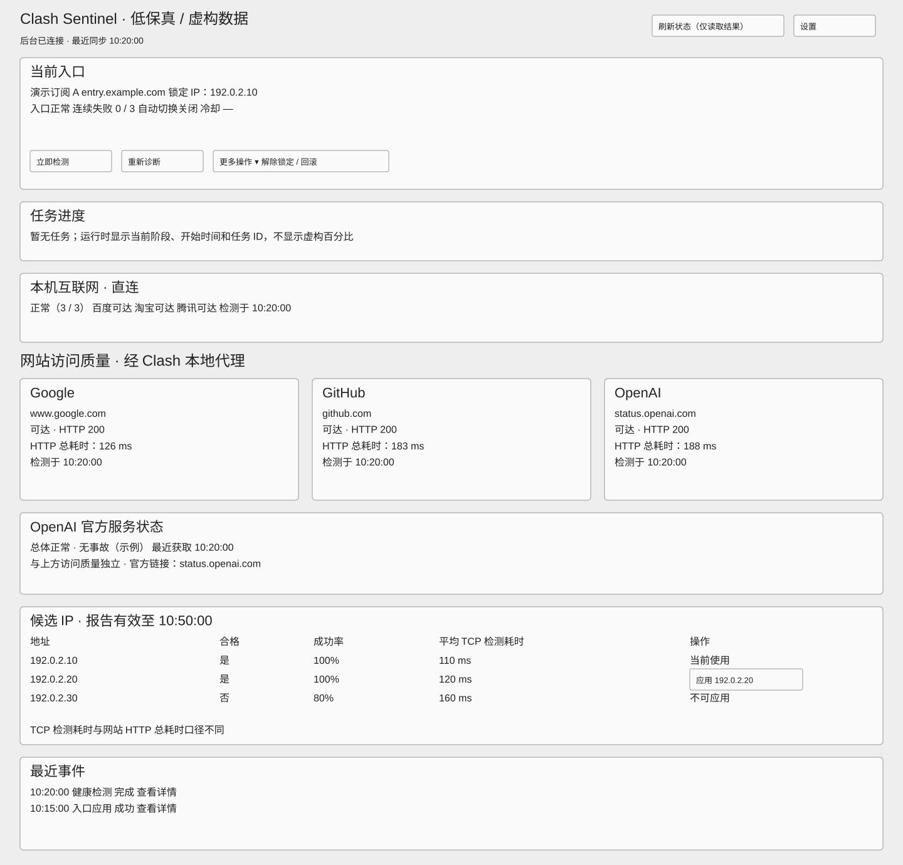
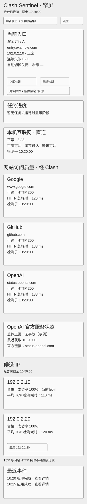
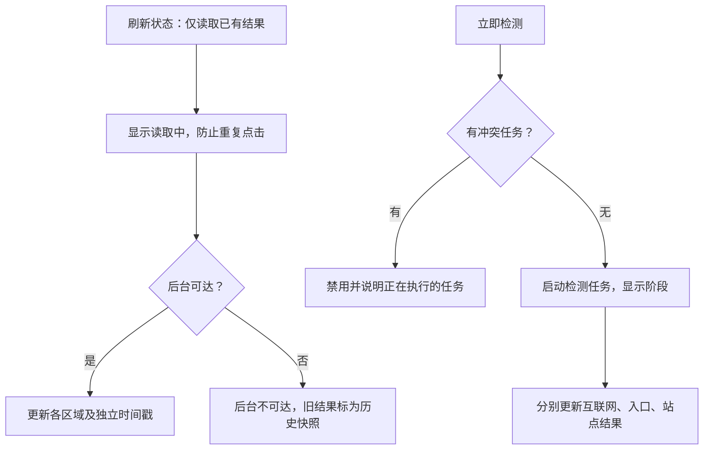
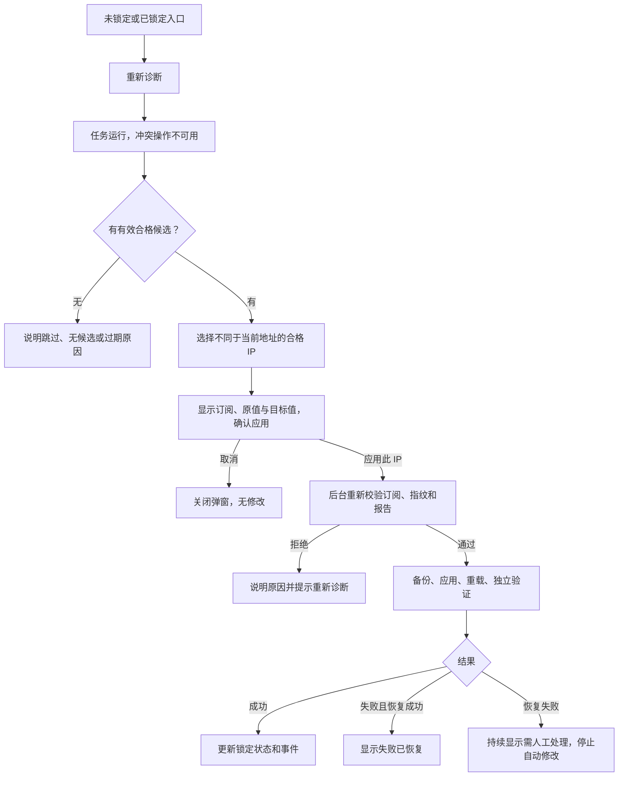
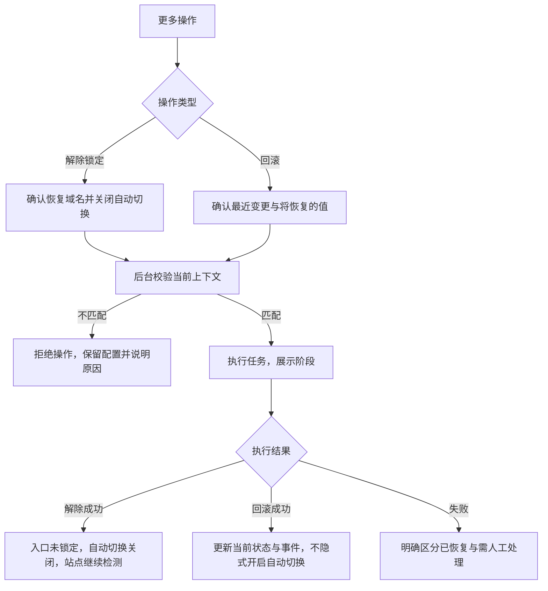
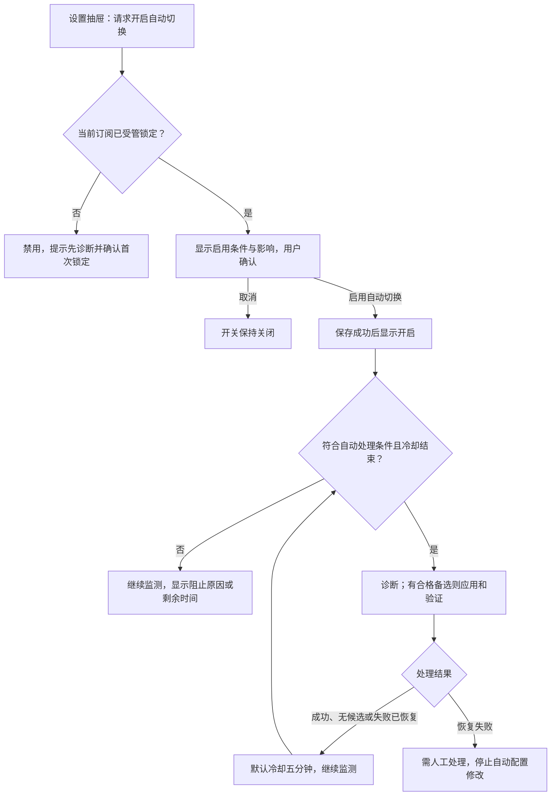
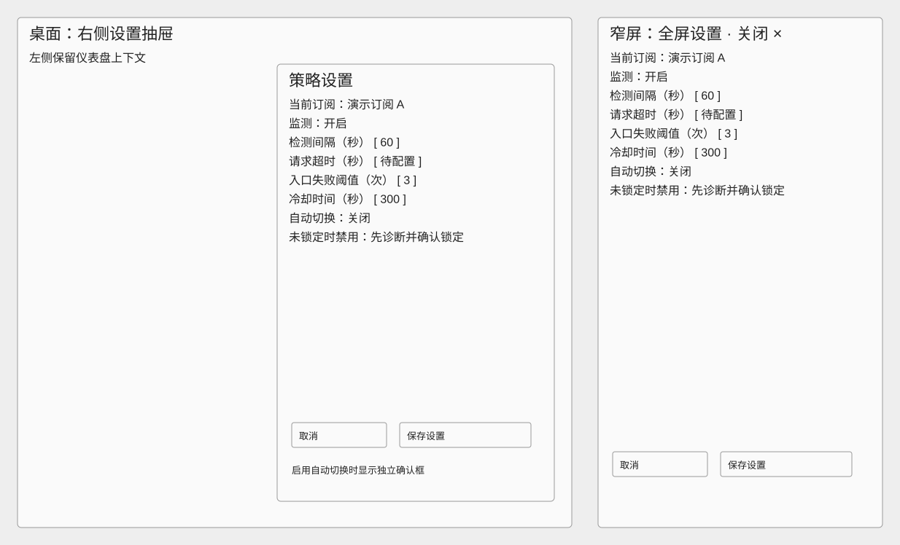
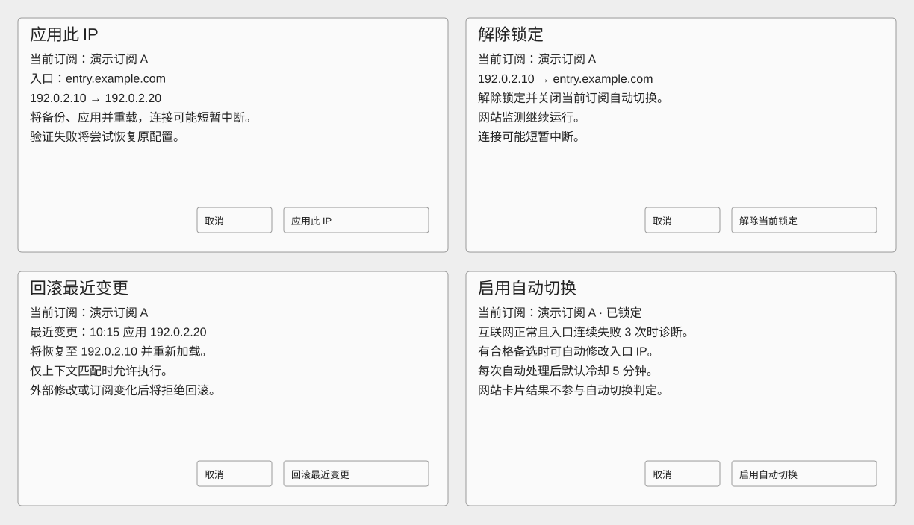
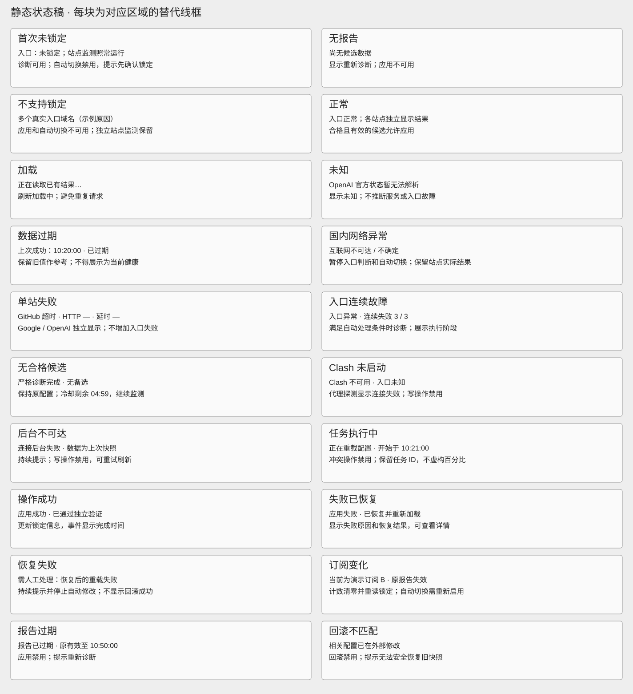

# Clash Sentinel 低保真原型

状态：交付自检完成，用户已认可交付验收，布局与操作路径已确认。全部指标、订阅及地址均为虚构示例，图稿不表示服务已实现。

依据：[项目规划](../../PROJECT_PLAN.md)、[实施步骤与 Step 0 冻结规则](../../STEP.md)。

## 1. 图稿入口

| 图稿 | 用途 |
| --- | --- |
| [桌面总览](wireframes/desktop.svg) | 1440px，正常状态下的全部区域 |
| [窄屏总览](wireframes/mobile.svg) | 390px，保持阅读顺序，卡片纵向排列 |
| [设置面板](wireframes/settings.svg) | 桌面右侧抽屉与窄屏全屏面板 |
| [确认弹窗](wireframes/confirmations.svg) | 应用、解除锁定、回滚、启用自动切换 |
| [状态稿](wireframes/states.svg) | 20 种正常与异常场景的区域替换稿 |

## 2. 信息结构与阅读顺序

单页从上到下为：工具栏、当前入口、运行任务、国内互联网、三站访问质量、OpenAI 官方状态、候选 IP、最近事件。设置通过右侧抽屉进入，窄屏改为全屏面板。

- 工具栏展示后台连接状态和最近同步时间。“刷新状态”只读取已有结果，旁注明确该含义。
- 入口区展示当前订阅、域名、锁定 IP、入口状态、失败次数、自动切换和冷却信息。“立即检测”触发一轮检测，“重新诊断”发现并严格检测候选 IP。
- 解除锁定和回滚置于“更多操作”，首次锁定从候选列表进入。
- 国内互联网区域显示百度、淘宝、腾讯的直连结果，至少两个可达才认为互联网正常；一个为不确定，零个为不可达。
- Google、GitHub、OpenAI 使用相同字段：可达性、HTTP 状态码、HTTP 总耗时（ms）、检测时间。OpenAI 的目标明确写为 status.openai.com，不代表 ChatGPT 或 API 可用性。
- OpenAI 官方总体状态与事故摘要单独展示，附官方链接。状态获取失败显示未知，不能解释成官方服务发生事故。
- 候选表展示地址、合格状态、成功率、平均 TCP 检测耗时、报告有效期和应用操作；TCP 与网站 HTTP 总耗时明确分开。
- 任务区展示任务 ID、开始时间和当前阶段。已知阶段包含诊断、校验、备份、应用、重载、验证和恢复，不推算进度百分比。
- 事件详情展示触发来源、影响订阅、必要的地址变化、结果及时间；不展示控制密钥、完整订阅和完整本机路径。

### 窄屏规则

390px 下保持同一阅读顺序。三站卡片纵向排列，候选表变成记录卡片；确认弹窗占视口宽度减两侧边距，正文可滚动，取消与具名确认按钮保持可见。设置全屏展示，关闭与取消均放弃尚未保存的编辑。

## 3. 操作流程

### 刷新与检测

“立即检测”不跳过已开启的自动切换策略；符合冻结条件时可能继续自动处理，入口区始终显示开关和冷却状态。刷新只读结果绝不触发该流程。

### 首次锁定与已锁定切换

首次应用弹窗原值显示“未锁定：entry.example.com”；切换时显示原锁定 IP。当前正在使用的候选显示“当前使用”，不提供重复应用按钮。首次锁定成功后自动切换仍关闭，由用户单独开启。

### 解除锁定与回滚

未锁定时解除锁定禁用；没有最近变更或上下文不匹配时回滚禁用并显示原因。前端可用状态不能替代后台的执行前校验。

### 开启自动切换与冷却

冷却到期只解除时间限制；仍需满足其余条件。订阅更新废弃旧报告与失败计数；切换到其他订阅后开关关闭，需重新启用。

## 4. 设置和确认文案

设置包含监测开关、检测间隔（默认 60 秒）、请求超时、入口失败阈值（默认 3 次）、冷却时间（默认 300 秒）、自动切换开关。请求超时尚未冻结，线框使用“待配置”，不在设计阶段擅自指定默认值。

普通策略编辑通过“保存设置”提交，成功后更新展示，失败保留编辑值并说明原因。暂停监测阻止后续定时任务；不会中断正在修改或恢复配置的任务。手动检测仍可用并标记为手动触发；暂停期间不自动发起配置修改。

自动切换开关是独立操作：请求开启进入独立确认，后台成功后才显示开启；普通“保存设置”不绕过启用确认。关闭自动切换直接保存，不打断已经执行中的恢复过程。

| 操作 | 文案要点 | 确认按钮 | 不可用或失效条件 |
| --- | --- | --- | --- |
| apply | 当前订阅、入口、原值与目标 IP；将备份并重载，可能短暂断连，验证失败尝试恢复 | 应用此 IP | 不合格、当前已使用、报告过期、上下文变化、冲突任务 |
| reset | 当前订阅、锁定 IP 与原始域名；解除后关闭自动切换，站点监测继续 | 解除当前锁定 | 未锁定、Clash 不可用、冲突任务 |
| rollback | 当前订阅、最近变更时间、变更内容与恢复目标；外部修改后拒绝覆盖 | 回滚最近变更 | 无备份、上下文不匹配、Clash 不可用、冲突任务 |
| 开启自动切换 | 当前订阅、已锁定入口；正常网络、三次入口失败、合格备选、五分钟冷却 | 启用自动切换 | 未受管锁定、当前需人工处理、后台不可达 |

所有弹窗包含“取消”，关闭等同取消。请求提交后禁止重复确认，转入持久任务区；刷新页面仅重新读取任务结果，不重放提交。

## 5. 状态清单

| 场景 | 显示内容 | 操作反馈 |
| --- | --- | --- |
| 首次未锁定 | 入口：未锁定；站点监测照常运行 | 诊断可用；自动切换禁用，提示先确认锁定 |
| 无报告 | 尚无候选数据 | 显示重新诊断；应用不可用 |
| 不支持锁定 | 多个真实入口域名（示例原因） | 应用和自动切换不可用；独立站点监测保留 |
| 正常 | 入口正常；各站点独立显示结果 | 合格且有效的候选允许应用 |
| 加载 | 正在读取已有结果… | 刷新加载中；避免重复请求 |
| 未知 | OpenAI 官方状态暂无法解析 | 显示未知；不推断服务或入口故障 |
| 数据过期 | 上次成功：10:20:00 · 已过期 | 保留旧值作参考；不得展示为当前健康 |
| 国内网络异常 | 互联网不可达 / 不确定 | 暂停入口判断和自动切换；保留站点实际结果 |
| 单站失败 | GitHub 超时 · HTTP — · 延时 — | Google / OpenAI 独立显示；不增加入口失败 |
| 入口连续故障 | 入口异常 · 连续失败 3 / 3 | 满足自动处理条件时诊断；展示执行阶段 |
| 无合格候选 | 严格诊断完成 · 无备选 | 保持原配置；冷却剩余 04:59，继续监测 |
| Clash 未启动 | Clash 不可用 · 入口未知 | 代理探测显示连接失败；写操作禁用 |
| 后台不可达 | 连接后台失败 · 数据为上次快照 | 持续提示；写操作禁用，可重试刷新 |
| 任务执行中 | 正在重载配置 · 开始于 10:21:00 | 冲突操作禁用；保留任务 ID，不虚构百分比 |
| 操作成功 | 应用成功 · 已通过独立验证 | 更新锁定信息，事件显示完成时间 |
| 失败已恢复 | 应用失败 · 已恢复并重新加载 | 显示失败原因和恢复结果，可查看详情 |
| 恢复失败 | 需人工处理：恢复后的重载失败 | 持续提示并停止自动修改；不显示回滚成功 |
| 订阅变化 | 当前为演示订阅 B · 原报告失效 | 计数清零并重读锁定；自动切换需重新启用 |
| 报告过期 | 报告已过期 · 原有效至 10:50:00 | 应用禁用；提示重新诊断 |
| 回滚不匹配 | 相关配置已在外部修改 | 回滚禁用；提示无法安全恢复旧快照 |

状态维度独立：后台连接、互联网、入口、每个站点和官方状态可以同时出现不同结果。状态稿是区域替换示例，并不意味着整页只能选一种状态。

- 超过两个检测周期未更新时显示“已过期”及原检测时间，历史成功值不作为当前健康证据。
- 请求失败时显示错误与可获得的 HTTP 状态码；没有响应时为“—”，延时为“—”，不得生成零毫秒的成功假象。
- 三站结果属于展示监控。切换后使用独立冒烟请求进行验证，即使目标同为 Google，也不复用卡片结果。
- 恢复失败提示持续可见，提供事件详情和人工检查说明。刷新页面不能自动解除该状态；首版原型不添加未经规划的一键强制恢复操作。
- 未锁定或不支持锁定只限制入口管理，独立站点探测仍根据实际网络情况给出结果。

## 6. 静态交付验收

- [x] 桌面 1440px、窄屏 390px 包含全部核心区域。
- [x] 三站使用同一指标集合，OpenAI 状态页与官方服务状态分开。
- [x] 刷新、检测、诊断与配置修改有不同操作入口及反馈。
- [x] 四类确认弹窗明确订阅、影响、取消和具名确认按钮。
- [x] 首次未锁定、无报告、Clash 未启动和异常恢复有明确状态。
- [x] SVG 可独立打开，文档图稿链接有效。
- [x] 用户审阅并认可布局与操作路径。

本次交付为静态低保真设计，不包含业务代码或真实网络探测。高保真阶段继续完善颜色、品牌图标和视觉规范。
