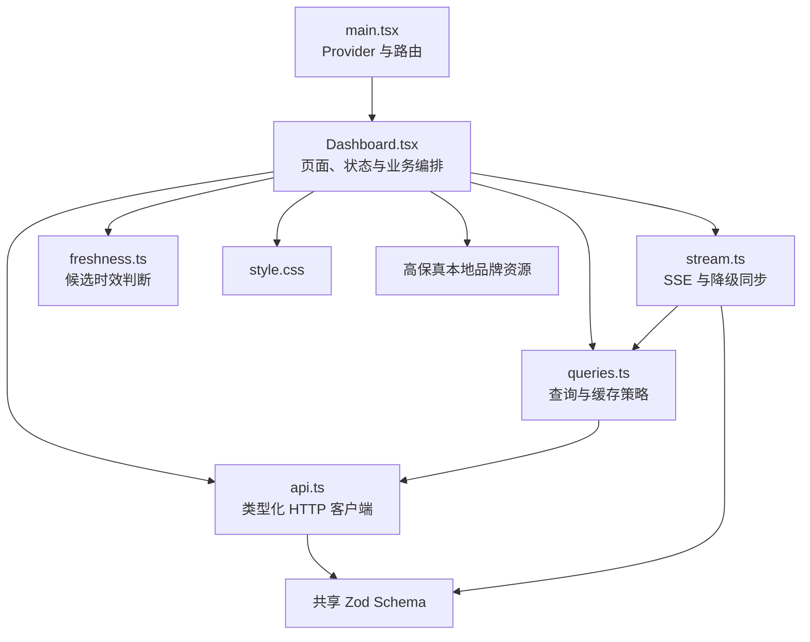
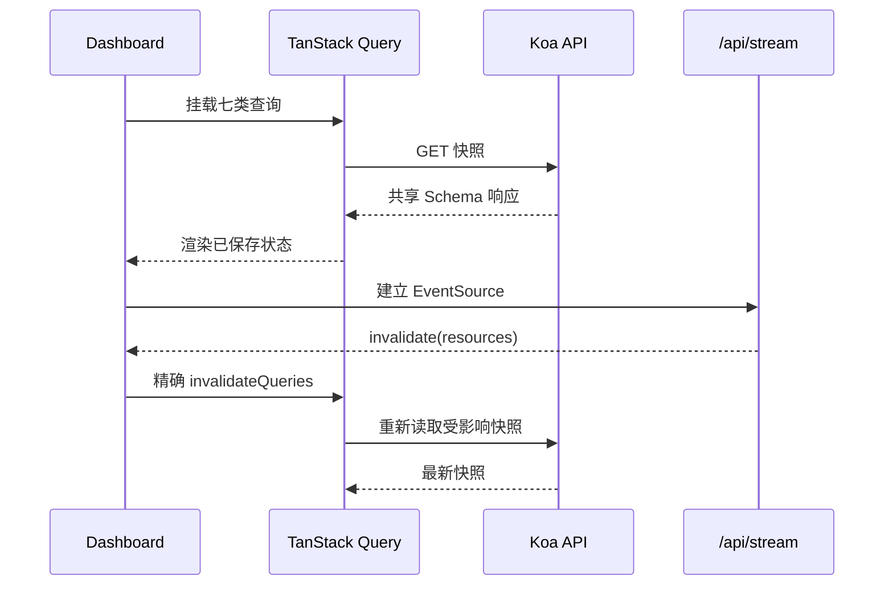
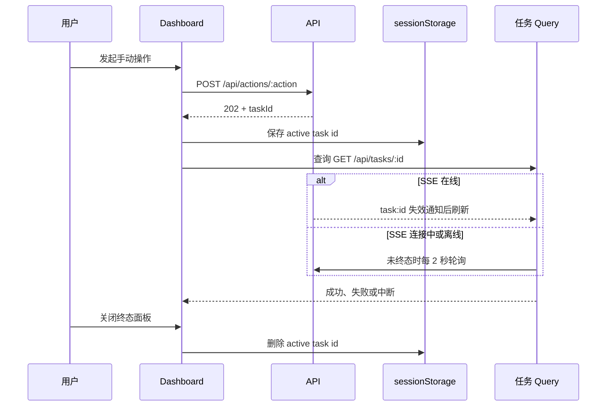
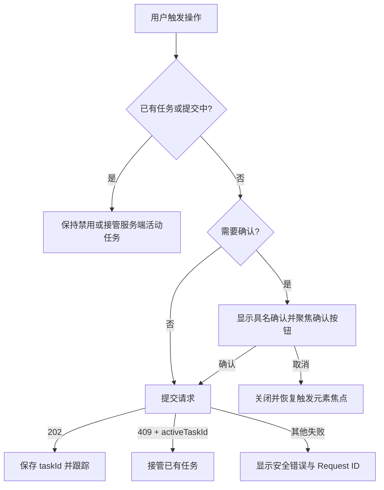

# Clash Sentinel 前端设计总览

> 文档状态：已实现现状说明（Step 18）  
> 适用版本：单机 MVP，2026-09-18 代码基线  
> 目标读者：前端开发、测试、维护者和首次接手项目的工程师  
> 实现结构演进：[Dashboard 重构设计](dashboard-refactor-design.md)  
> 精确接口契约：[API 设计](api-design.md)

## 1. 定位与事实源

本文解释前端为什么这样设计、当前页面如何协作以及必须保持的用户行为，不重复维护 HTTP 字段的完整定义。发生冲突时，事实源按以下顺序确定：

| 内容 | 事实源 |
| --- | --- |
| API 字段、枚举和校验 | `packages/shared/src` 中的 Zod Schema |
| HTTP/SSE 路径和错误语义 | `docs/api-design.md`、服务端路由 |
| 请求超时和错误转换 | `apps/web/src/api.ts` |
| Query Key、缓存刷新和任务轮询 | `apps/web/src/queries.ts` |
| SSE 重连、失效通知和降级同步 | `apps/web/src/stream.ts` |
| 当前页面行为和可访问性 | `apps/web/src/Dashboard.tsx` |
| 当前样式和响应式断点 | `apps/web/src/style.css` |
| 视觉与交互基准 | `docs/design/high-fidelity/README.md` 及其截图 |

修改上述事实源时，必须在同一变更中更新本文或对应专题。本文维护协作关系和约束；精确契约只在其事实源维护。

## 2. 目标、边界与技术栈

前端是运行于浏览器的本机单页工作台，帮助用户查看 Clash Sentinel 已保存的状态并显式发起管理操作。它不直接访问 SQLite、Clash/Mihomo 或 Legacy Shell，也不自行推断后台健康结论。

当前技术栈：

- React 19 负责视图和本地交互状态；React Router 7 提供单页兜底路由。
- TanStack Query 5 保存服务端快照，并统一完成请求状态与缓存失效。
- Vite 7 提供开发与生产构建；开发时将同源 `/api` 转发至 Koa。
- `@clash-sentinel/shared` 提供响应、设置、任务、事件和 SSE 通知 Schema。
- 原生 `EventSource` 接收 SSE 失效通知；原生 `sessionStorage` 只保存当前任务 ID。

生产环境中页面和 API 均由 Koa 在 `127.0.0.1:3000` 提供。页面没有认证或公网部署设计，安全边界依赖服务只监听本机回环地址。

## 3. 当前实现结构

`Dashboard.tsx` 当前约 1,375 行，同时包含页面编排、查询、Mutation、任务恢复、对话框、设置表单和所有功能组件。当前行为完整，但职责耦合过多；目标拆分见 [Dashboard 重构设计](dashboard-refactor-design.md)。

## 4. 已实现功能

### 4.1 页面信息架构

页面阅读顺序固定为：

1. 顶栏连接状态、同步时间、只读刷新和设置入口；
2. 定时监测状态；
3. 全局加载、离线、部分失败和操作冲突提示；
4. 当前后台任务；
5. 当前入口、锁定信息、失败次数、自动切换与手动操作；
6. 百度、淘宝、腾讯直连基线；
7. Google、GitHub、OpenAI 代理访问质量；
8. 最近诊断候选与最近事件；
9. 设置抽屉和危险操作确认框。

### 4.2 七类只读快照

| Query Key | 接口 | 页面用途 |
| --- | --- | --- |
| `health` | `GET /api/health` | 判断后台是否可达；3 秒快速失败 |
| `monitoring` | `GET /api/monitoring` | 调度状态、上下轮时间和活动任务 |
| `status` | `GET /api/status` | 当前入口、锁定、健康和冷却状态 |
| `sites` | `GET /api/sites` | 六个固定站点的最新结果 |
| `candidates` | `GET /api/candidates` | 最近诊断及候选 IP |
| `events` | `GET /api/events?limit=50&offset=0` | 最近事件；页面展示前八条 |
| `settings` | `GET /api/settings` | 监测、超时、阈值、冷却和自动切换设置 |

普通快照使用 12 秒超时，所有响应均先通过共享 Schema 校验。默认缓存永久保持 fresh，不依赖窗口聚焦或网络恢复自动刷新；刷新只能由首次查询、SSE 通知、断线降级、页面重新可见或用户点击“刷新状态”触发。

“刷新状态”只使七类读取 Query 失效，不创建任务、不执行检测，也不修改设置。

### 4.3 手动操作与设置

前端提供五个手动任务入口：`health-check`、`diagnose`、`apply`、`reset` 和 `rollback`。立即检测和重新诊断直接提交；应用候选、解除锁定和回滚必须先显示具名确认。启用自动切换同样需要确认，关闭则直接保存。

设置抽屉编辑检测间隔、请求超时、入口失败阈值、冷却时间和定时监测开关。提交前使用共享 `settingsUpdateSchema` 校验，并把秒、分钟转换为毫秒。自动切换绑定当前订阅 UID；未锁定、后台离线或任务繁忙时不允许启用。

设置保存成功后直接更新 `settings` 缓存并使 `monitoring` 失效；完整设置保存成功还会关闭抽屉并把焦点还给设置按钮。

## 5. 数据同步设计

### 5.1 查询与 SSE

SSE 只发送资源失效通知，不承载完整快照。相同事件循环中的多个通知先合并，再按资源精确使 Query 失效；`task:<id>` 映射到对应任务 Query。收到 `sync` 通知时重新读取全部六类业务快照，不额外刷新存活探针。

连接断开后使用 1、2、5、10、30 秒退避重连，同时每 15 秒刷新全部七类 Dashboard Query；标签页隐藏时暂停低频刷新。页面重新可见时刷新六类业务快照。恢复连接后停止降级定时器。

### 5.2 异步任务跟踪

刷新页面后从 `clash-sentinel.active-task-id` 恢复任务；若监测快照报告另一活动任务，则接管该任务。服务端以 `activeTaskId` 返回冲突时，页面同样切换到已有任务并提示用户。任务达到 `succeeded`、`failed` 或 `interrupted` 后停止轮询，但保留面板直至用户关闭。

失败结果区分无需恢复、已经恢复、恢复失败和结果未知；配置类任务无法确认恢复时必须提示人工检查。

### 5.3 设置与操作流程

## 6. 页面状态模型

| 状态 | 判定 | 表现与约束 |
| --- | --- | --- |
| 首次加载 | 任一基础 Query pending | 显示“读取已有快照”；不得触发网络检测 |
| 后台刷新 | 任一基础 Query fetching | 刷新按钮显示“刷新中”并禁用 |
| 后台不可达 | `health` 查询失败 | 所有快照视为可能过期，禁用写操作 |
| SSE 离线 | 存活探针成功但流状态 `offline` | 显示低频同步提示，15 秒降级刷新 |
| 部分失败 | 非 `health` Query 有错误 | 保留可用数据并显示首个安全错误 |
| 数据过期 | 后台离线或站点返回 `stale` | 使用中性状态，不能继续显示为当前健康 |
| 候选过期 | 超过候选有效期或后台离线 | 禁止应用候选 |
| 任务繁忙 | Mutation pending 或任务 queued/running | 禁止重复手动操作和相关设置修改 |
| 操作冲突 | 错误详情含 `activeTaskId` | 接管已有任务，不重复提交 |
| 配置恢复异常 | `recovery_failed`，或配置任务结果未知 | 显示“需人工处理”及检查说明 |

后台连接、入口健康、站点可达和官方服务状态是互相独立的维度，不得用其中一个替代另一个。

## 7. 响应式、可访问性与视觉约束

- 桌面视觉验收基准为 1440px，窄屏基准为 390px。
- 900px 以下收拢监测、入口、任务和下方双栏；620px 以下使用单列卡片和紧凑顶栏。
- 状态同时使用文字与颜色，不允许仅靠颜色表达。
- 主区块通过标题和 `aria-labelledby` 建立结构；异步任务使用 `aria-live="polite"`。
- 错误使用 `role="alert"`，非阻断状态使用 `role="status"`。
- 确认框使用 `role="dialog"`、`aria-modal="true"`；打开后聚焦确认按钮，Escape 或取消后恢复原触发元素焦点。
- 设置抽屉支持 Escape 和点击遮罩关闭，关闭后恢复设置按钮焦点。
- 图标和装饰标记使用 `aria-hidden`；图标按钮必须有文本化 `aria-label`。
- `prefers-reduced-motion: reduce` 时关闭过渡和滚动动画。
- Step 19 拆分不得改变现有文案、DOM 语义、键盘路径、焦点返回和响应式结果。

## 8. 安全与隐私边界

- 前端只调用同源相对路径，不保存或拼接 Mihomo 密钥、订阅正文和本机配置路径。
- API 错误只展示服务端安全消息和可选 Request ID；未知响应、超时和网络错误转换为固定文案。
- `sessionStorage` 仅保存当前任务 UUID，不保存响应快照、设置或凭据，关闭标签页后自然清除。
- 共享 Schema 验证失败时拒绝使用响应，不把未知结构渲染到页面。
- React 默认文本转义继续作为展示服务端摘要的边界，不使用原始 HTML 注入。
- 页面不执行读取即写入；检测、诊断和配置变更只能由明确按钮触发。

## 9. 已知限制与演进

- 当前只有一个 Dashboard 路由，React Router 尚未承担多页面导航。
- `Dashboard.tsx` 和 `style.css` 体积过大，组件、业务状态与基础设施生命周期耦合。
- 现有 Vitest 覆盖 API、候选时效、Query 策略和 SSE，但没有 DOM 级组件与 Hook 测试。
- SSE 断线提示和降级轮询可用，但浏览器没有跨标签页任务协调。
- Step 19 只做结构性重构和补充测试，不改变产品功能、接口或视觉。

## 10. 测试策略与追踪

| 需求/风险 | 设计位置 | 实现事实源 | 当前或目标测试 |
| --- | --- | --- | --- |
| 响应必须类型安全 | 4.2、8 | `api.ts`、共享 Schema | `api.test.ts` |
| 读取刷新无业务副作用 | 4.2 | `queries.ts` | `queries.test.ts`、Playwright smoke |
| SSE 精确失效与重连 | 5.1 | `stream.ts` | `stream.test.ts` |
| 候选过期不可应用 | 6 | `freshness.ts`、`Dashboard.tsx` | `freshness.test.ts`、Step 19 组件测试 |
| 任务恢复与轮询降级 | 5.2 | `Dashboard.tsx`、`queries.ts` | `queries.test.ts`、Step 19 Hook 测试 |
| 危险操作必须确认 | 4.3、5.3 | `Dashboard.tsx` | Playwright smoke、Step 19 组件测试 |
| 错误、恢复状态可辨识 | 6 | `Dashboard.tsx` | Playwright smoke、Step 19 组件测试 |
| 响应式与键盘可用 | 7 | `style.css`、`Dashboard.tsx` | 高保真原型测试、Step 19 Playwright |

任何前端行为变更至少执行 `npm run format:check`、`npm run lint`、`npm run typecheck`、`npm test` 和 `npm run build`；交互或样式变更还应执行 `npm run test:e2e` 并在 1440px、390px、900px 和 620px 复核。

