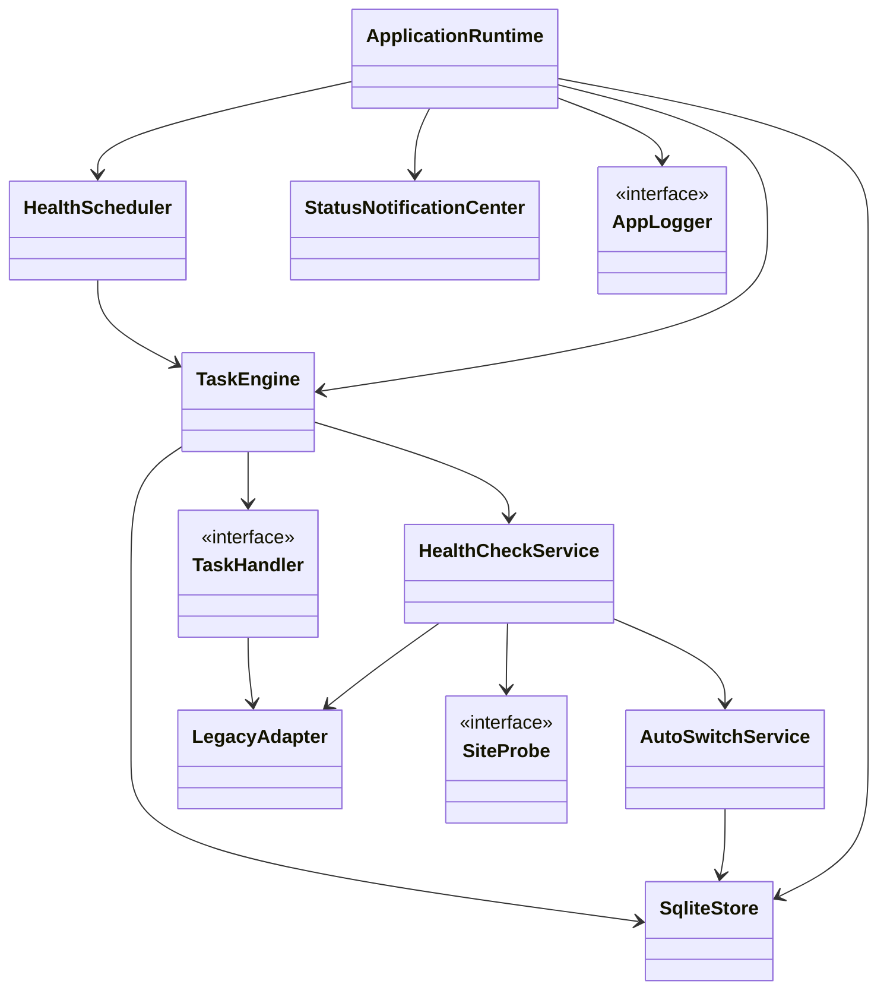
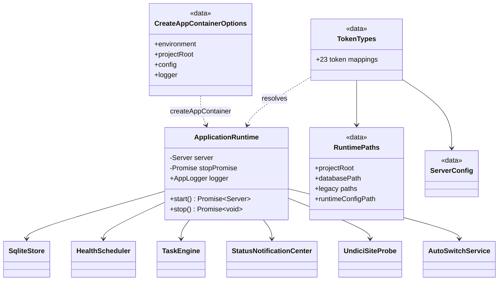
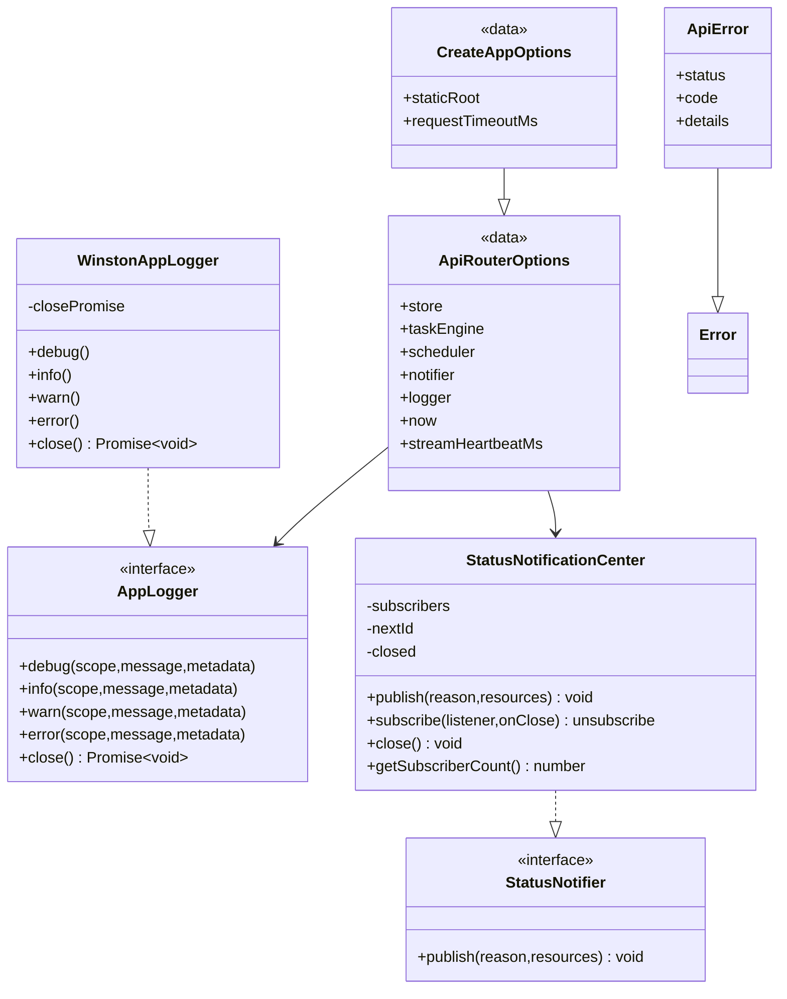
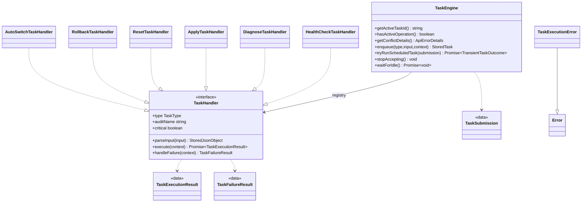
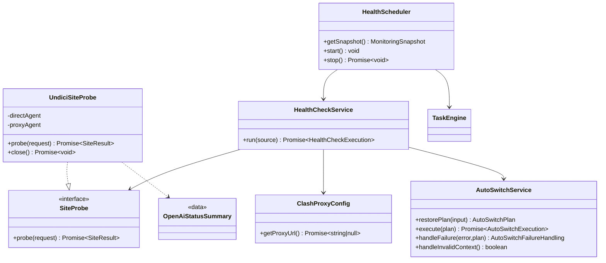
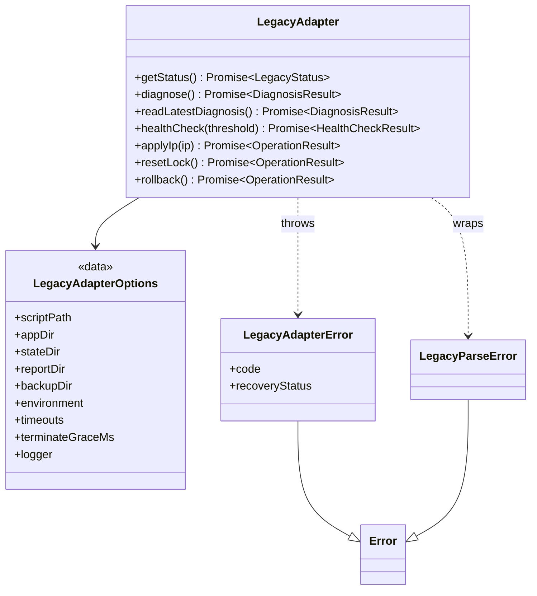
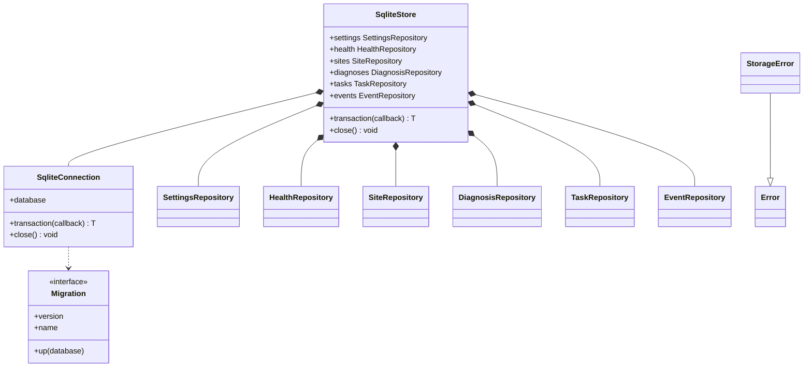
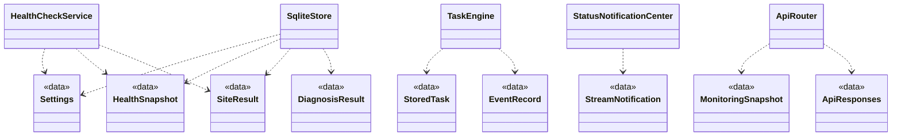

# Clash Sentinel 服务端类与接口设计

> 状态：已实现，随生产源码持续维护
>
> 适用范围：`apps/server/src` 生产代码及服务端直接使用的 `packages/shared/src` 契约
>
> 目标读者：服务端维护者、代码审查者、测试编写者和需要理解服务端类型边界的开发者
>
> 最近核对：2026-09-18，Step 17 补充设计

本文是[服务端设计总览](server-design.md)的实现结构专题。总览解释系统边界和组件如何协作；
本文解释类、接口、关键类型和成员分别承担什么职责。HTTP/SSE 的精确线协议仍以
[API 设计](api-design.md)为准，SQLite 字段以[数据库设计](database-design.md)为准，容器行为以
[TSyringe 专题](tsyringe.md)为准。

## 1. 收录与阅读约定

### 1.1 事实源

- 类、接口、方法和可见性：`apps/server/src` 中排除 `*.test.ts` 的生产源码。
- 领域对象和 API DTO：`packages/shared/src` 中的 Zod Schema 及其推导类型。
- 依赖关系和生命周期：`composition/container.ts`、`tokens.ts` 和构造函数。
- 行为细节：对应实现及测试；本文不取代源码和测试。

修改生产类、接口、公共成员、构造依赖或实现关系时，必须在同一个变更中更新本文。纯私有重构
只有在改变职责、不变量、资源所有权或调用顺序时才需要更新。

### 1.2 UML 记号

- `<<interface>>` 表示行为契约，`<<data>>` 表示只携带数据的接口或类型。
- `..|>` 表示实现，`--|>` 表示继承，`-->` 表示持有或直接调用，`..>` 表示临时依赖。
- `+` 为公共成员，`-` 为私有成员；复杂 `Pick<>` 和回调签名在图中简写，正文保留语义。
- TypeScript 没有项目级基础类；复用主要通过接口、结构类型、组合和依赖注入完成。

### 1.3 总览

## 2. 运行时与依赖装配

### 2.1 `ApplicationRuntime`

源码：`apps/server/src/application-runtime.ts`。生产应用唯一根，生命周期为 child container 内单例。

构造依赖为 `SqliteStore`、`AutoSwitchService`、`TaskEngine`、`HealthScheduler`、
`StatusNotificationCenter`、`UndiciSiteProbe`、`AppLogger`、进程环境和 HTTP 监听参数。解析对象图时
可打开 SQLite，但网络监听、探测和定时器必须等到 `start()`。

| 成员 | 用途与约束 |
| --- | --- |
| `logger: AppLogger` | 只读 getter，供进程入口复用容器内统一日志器。 |
| `start(): Promise<Server>` | 恢复中断任务，创建 Koa，等待监听成功，再启动非测试环境调度器；恢复或监听失败向上抛出。 |
| `stop(): Promise<void>` | 幂等停机；重复调用复用同一个 Promise。依次停止接收任务、调度与 SSE，并行等待 HTTP/调度/任务空闲，最后关闭探测器和数据库。 |

私有职责：`stopResources()` 捕获每个关闭步骤的异常，继续释放后续资源，最终以
`AggregateError` 汇总；`server` 和 `stopPromise` 只维护生命周期状态。

### 2.2 容器入口与基础配置结构

| 类型/函数 | 成员或输入 | 用途 |
| --- | --- | --- |
| `CreateAppContainerOptions` | `environment?`、`projectRoot?`、`config?`、`logger?` | 为生产或测试创建独立 child container；省略项按生产规则加载。 |
| `createAppContainer(options?)` | 返回 `DependencyContainer` | 注册值依赖、仓储、服务、Handler 注册表和 `ApplicationRuntime`；是唯一合法容器工厂。 |
| `TokenTypes` | `TOKENS` 的 23 个 Symbol 到具体类型的映射 | 为注册和 `resolve<T>()` 提供编译期类型；不产生运行时对象。 |
| `RuntimePaths` | 项目根、数据库、Legacy 脚本/状态/报告/备份、Clash 目录和运行配置路径 | 集中描述运行路径，避免依赖 `process.cwd()`。 |
| `ServerConfig` | `logging`、`storage` 脱敏配置 | 由严格 Zod Schema 推导，仅在启动时加载。 |
| `resolveRuntimePaths()` | 环境和可选项目根 | 按环境变量与默认规则生成 `RuntimePaths`。 |
| `loadServerConfig()` | 环境和可选项目根 | 读取 YAML 并拒绝缺失、未知或非法字段。 |

`RuntimePaths` 的完整字段为 `projectRoot`、`databasePath`、`legacyScriptPath`、`appDir`、
`legacyStateDir`、`legacyReportDir`、`legacyBackupDir`、`runtimeConfigPath`。

`TOKENS` 分为日志/环境/配置/路径/时钟等值依赖，Store 与六个 Repository，Legacy 与健康服务，
任务和通知服务，以及 `httpListen`。所有进程级可变服务使用 `ContainerScoped` 或 child 内缓存工厂；
禁止业务对象接收容器实例。

## 3. API、日志与通知基础设施

### 3.1 API 边界

| 类型/函数 | 成员或行为 |
| --- | --- |
| `ApiRouterOptions` | 必填 `store`、`taskEngine`、`scheduler`、`notifier`、`logger`；可选时钟与 SSE 心跳间隔用于测试。 |
| `CreateAppOptions` | 继承路由依赖，并增加静态目录、请求超时和可覆盖日志器。 |
| `createApiRouter(options)` | 创建全部 `/api` 路由；读取接口只读快照，动作接口只入队，不执行隐式刷新。 |
| `createApp(options)` | 组装 Request ID、日志、超时、正文解析、统一错误、API 路由和 SPA 静态回退。 |
| `ApiError` | `Error` 子类；构造时固定 HTTP `status`、稳定 `code`、安全 `message` 和可选脱敏 `details`。 |

`ApiError` 不保存原始请求体或敏感 cause。未知异常由应用边界转换成 `INTERNAL_ERROR`，详细堆栈只
进入受控日志。

### 3.2 `AppLogger` 与 `WinstonAppLogger`

`AppLogger` 是服务端最基础的可替换接口之一，所有日志方法接收稳定 `LogScope`、自然语言消息和
可选结构化元数据。

| 成员 | 说明 |
| --- | --- |
| `debug/info/warn/error(scope, message, metadata?)` | 按等级写日志；元数据在格式化前执行错误归一化和敏感信息处理。 |
| `close(): Promise<void>` | 刷新并关闭 transport；必须可被停机流程等待。 |

`WinstonAppLogger` 是内部实现，持有 Winston logger 和幂等 `closePromise`；四个等级方法统一委托
私有 `write()`。`CreateAppLoggerOptions` 的字段为 `environment?`、`redactSensitiveData?`、`isTTY?`、
`now?`、`transport?`，分别允许覆盖环境、脱敏、TTY 判断、时钟和输出 transport。
`createAppLogger()` 创建生产实现，`noopLogger` 用于无副作用默认值和单元测试。

### 3.3 `StatusNotifier` 与 `StatusNotificationCenter`

`StatusNotifier.publish(reason, resources)` 是业务层最小发布接口。`StatusNotificationCenter` 同时
提供路由订阅能力：

| 成员 | 说明 |
| --- | --- |
| `publish(reason, resources)` | 创建经 Schema 校验的通知并广播；关闭后无副作用，单个监听器异常被隔离。 |
| `subscribe(listener, onClose?)` | 注册订阅者并立即发送一次全资源 `sync`；返回幂等退订函数。 |
| `close()` | 幂等关闭全部连接并调用各订阅者关闭回调；之后不再接受有效订阅。 |
| `getSubscriberCount()` | 仅供监测和测试确认资源释放。 |

内部 `Subscriber` 只保存监听器与关闭回调，不是公共契约；私有方法负责创建单调进程内 ID、隔离
投递失败和安全关闭订阅者。

## 4. 任务体系

### 4.1 基础任务契约

| 接口/类型 | 成员与用途 |
| --- | --- |
| `TaskSubmission` | `type`、可选 `input`/日志 `metadata`/`queuedResources`；描述将被持久化或瞬时执行的任务。 |
| `TaskAudit` | 可选安全 `summary` 和 `details`，覆盖引擎生成的默认审计。 |
| `TaskExecutionResult` | `result`、`changedResources`、可选 `audit` 和声明式 `nextTasks`。 |
| `TaskFailureResult` | 稳定 `code/message`、`recoveryStatus`、变化资源和可选审计。 |
| `TaskExecutionIdentity` | ID、类型、输入及 `persistent/transient` 身份。 |
| `TaskHandlerContext` | 已校验任务身份、输入和统一日志器。 |
| `TaskHandlerFailureContext` | 继承执行上下文并增加仅供服务端判断的原始 `error`。 |
| `TaskHandlerRegistry` | 编译期要求每个 `TaskType` 恰好映射到同类型 Handler。 |
| `LegacyOperations` | Handler 使用的最小 Legacy 能力集合。 |

`TaskExecutionIdentity.persistence` 明确区分 `persistent` 与 `transient`；`TaskLogContext.requestId?` 只
用于关联提交请求日志，不写入任务输入。`StartupRecoveryOptions` 由最小 `store` 事务/仓储接口和
`autoSwitch` 失效上下文处理接口组成。

`TaskHandler` 是任务扩展基础接口：

| 成员 | 说明 |
| --- | --- |
| `type` | 唯一稳定任务类型，必须与注册键一致。 |
| `auditName` | 默认中文审计动作名。 |
| `critical` | 是否属于需要恢复结论和关键审计的配置动作。 |
| `parseInput(input)` | 在副作用前校验、拒绝或归一化持久化输入。 |
| `execute(context)` | 执行领域行为，只返回结果、变化资源、审计和后续任务，不维护公共生命周期。 |
| `handleFailure?(context)` | 将异常转换成安全、可持久化的失败结果；缺省时由引擎保守处理。 |

`TaskExecutionError` 携带已经完成领域恢复处理的 `TaskFailureResult`，可用内部 `cause` 记录原异常，
但对外只暴露安全结论。`asStoredJson()` 只对已通过领域校验的对象提供编译期标记。

### 4.2 `TaskEngine`

生命周期为 child container 内单例。构造依赖任务/事件仓储、不可变 Handler 注册表、通知器和日志器；
内部唯一租约通过 `activeOperation`、`activeToken` 和 `activeCompletion` 防止并发 Legacy 动作。

| 公共成员 | 说明 |
| --- | --- |
| `getActiveTaskId()` | 返回当前持久化任务 ID；瞬时定时检测返回空。 |
| `hasActiveOperation()` | 判断全局执行槽是否占用。 |
| `getConflictDetails()` | 为 API 生成 `activeTaskId` 或固定 `activeOperation`。 |
| `enqueue(type, input?, context?)` | 获取租约、创建 `queued` 任务并异步运行；冲突或停机时抛稳定 API 错误。 |
| `tryRunScheduledTask(submission)` | 尝试瞬时执行定时根任务；冲突时返回 `busy`，不创建根任务记录。 |
| `stopAccepting()` | 同步拒绝后续任务，不中断已开始动作。 |
| `waitForIdle()` | 等待当前执行链及声明式后续任务完成。 |

私有职责按组划分：创建与状态转换、持久/瞬时执行、Handler 调用和失败归一化、审计与通知、
Handler 完整性校验，以及租约获取/替换/释放。租约必须由创建它的 token 释放。

### 4.3 六个 Handler

所有 Handler 均实现 `TaskHandler`，公共成员固定为 `type`、`auditName`、`critical`、`parseInput()`、
`execute()`；除健康检查外，均按需要实现 `handleFailure()`。

| 类 | 类型/关键性 | 构造依赖 | `execute()` 与失败语义 |
| --- | --- | --- | --- |
| `HealthCheckTaskHandler` | `health_check` / 非关键 | `HealthCheckService`、`AutoSwitchService` | 执行手动或定时健康检查，计算精确变化资源，并可声明后续 `auto_switch`。私有 `changedResources()` 将变化标志映射为 SSE 资源。 |
| `DiagnoseTaskHandler` | `diagnose` / 非关键 | Legacy、诊断仓储 | 执行严格诊断并整体替换最近诊断；失败转为稳定 Legacy 结论。 |
| `ApplyTaskHandler` | `apply` / 关键 | Legacy、诊断/健康仓储、配置任务支持 | 校验候选与上下文后应用 IP，刷新状态；失败保留真实恢复结论。 |
| `ResetTaskHandler` | `reset` / 关键 | Legacy、设置/诊断/健康仓储 | 解除锁定、关闭自动切换并刷新状态；失败按配置动作处理。 |
| `RollbackTaskHandler` | `rollback` / 关键 | Legacy、设置/诊断/健康仓储 | 回滚最近匹配变更并刷新状态；拒绝过期或不匹配上下文。 |
| `AutoSwitchTaskHandler` | `auto_switch` / 关键 | `AutoSwitchService` | 恢复计划后执行诊断/选择/应用，写入冷却；`handleFailure()` 调用自动切换失败策略。 |

`ConfigurationOperations` 是三个手动配置 Handler 共享的最小依赖结构；
`refreshHealthSnapshotAfterConfiguration()` 在配置动作后重新读取安全状态并返回受影响资源。
`legacyFailure()` 将 `LegacyAdapterError` 转成统一任务失败结果。

## 5. 健康检测与自动切换

### 5.1 探测基础接口

`SiteProbeRequest` 包含 `target`、`url`、`timeoutMs` 和可空 `proxyUrl`。`SiteProbe.probe(request)` 无论成功或
预期网络失败都返回稳定 `SiteResult`；只有编程或生命周期错误才应抛出。

`UndiciSiteProbe` 实现该接口：

| 成员 | 说明 |
| --- | --- |
| `probe(request)` | 选择直连或代理 dispatcher，记录 HTTP 总耗时，分类错误；OpenAI 目标额外解析官方状态。 |
| `close()` | 关闭直连、当前代理及仍在回收的旧代理 Agent；由应用停机等待。 |

私有职责：按代理 URL 复用/替换 Agent，异步回收旧 Agent，并将 DNS、连接、TLS、代理、超时、HTTP
和解析错误稳定映射。`classifyProbeError()` 是无副作用错误分类函数。

`ClashProxyConfig.getProxyUrl()` 读取 Mihomo 运行 YAML，返回本机 HTTP/mixed 代理地址；无可用端口
时返回 `null`，非法配置抛出错误。实例只持有配置路径，不缓存内容。

### 5.2 `HealthCheckService`

构造依赖 Legacy 最小接口、六站探测器、代理配置、设置/健康/站点/诊断/事件仓储、自动切换服务、
时钟和日志器。

| 成员 | 说明 |
| --- | --- |
| `run(source: 'manual' | 'scheduled')` | 串联身份读取、国内直连、海外代理、快照判定、事务写入和自动切换规划，返回 `HealthCheckExecution`。 |

`HealthCheckExecution` 包含最终 `snapshot`、`changes` 和可选 `autoSwitchRequest`。
`HealthCheckChanges` 的字段为 `statusUpdated`、`sitesUpdated`、`candidatesUpdated`、`eventAppended`、
`settingsUpdated`；`AutoSwitchRequest` 的字段为 `currentIp`、`profileUid`、`reuseDiagnosis`。私有方法
分为：安全读取与身份变化、Legacy 基线、
基础/最终状态计算、代理失败修正、事件安全追加和自动切换准备。事件写入失败不能掩盖健康结论。

### 5.3 `HealthScheduler`

| 成员 | 说明 |
| --- | --- |
| `getSnapshot()` | 返回 `waiting/running/disabled`、最近启停时间、下次计划时间和当前活动任务。无副作用。 |
| `start()` | 幂等启动并立即安排首轮；只负责计时，不绕过 Task Engine 租约。 |
| `stop()` | 幂等取消后续 timer，并等待正在执行的轮次完成。 |

内部状态包括 timer、当前轮次 Promise、停止标志和三个时间戳。私有 `runTick()` 通过
`tryRunScheduledTask()` 执行瞬时健康任务，`schedule()` 从上一轮完成时间安排下一轮，失败事件写入
使用安全降级。

### 5.4 `AutoSwitchService`

| 成员 | 说明 |
| --- | --- |
| `restorePlan(input)` | 结合当前设置、健康快照和输入重新校验上下文，返回带阶段信息的 `AutoSwitchPlan`。 |
| `execute(plan)` | 诊断或复用诊断、选择不同合格候选、应用并写入快照/冷却，返回结果、资源和审计。 |
| `handleFailure(error, plan)` | 根据执行阶段和 Legacy 恢复结论决定冷却、关闭开关及资源变化。 |
| `handleInvalidContext()` | 关闭自动切换并清空绑定 UID；返回设置是否实际变化。 |

`AutoSwitchPlan` 包含 `input`、`snapshot`、`source`、`parentId`、`reuseDiagnosis`、`phase`；
`AutoSwitchTaskInput` 包含 `trigger`、`parentId`、`currentIp`、`profileUid`、`reuseDiagnosis`；
`AutoSwitchExecution` 包含 `result`、`changedResources`、`eventSummary`、`eventDetails`；
`AutoSwitchFailureHandling` 包含 `recoveryStatus` 和 `changedResources`。它们分别描述重建计划、
持久化输入、成功输出和失败策略输出。私有方法只负责失败策略以及推荐 IP、冷却和成功
快照写入。纯策略函数 `canAutoSwitch()` 判断准入，`selectAutoSwitchCandidate()` 以延迟和 IP 稳定选取。

`OpenAiStatusSummary` 只包含官方 `serviceStatus` 和 `incidentSummary`；`parseOpenAiStatus()` 对未知或非法正文
返回保守 `unknown`，不将状态页解析失败推断成 OpenAI 事故。

## 6. Legacy 适配与解析

### 6.1 `LegacyAdapter`

生命周期为 child container 内单例，但不持有常驻子进程。构造时归一化路径、环境、各命令超时、
终止宽限期和日志器。

| 公共成员 | 说明 |
| --- | --- |
| `getStatus()` | 运行只读状态命令并解析 `LegacyStatus`。 |
| `diagnose()` | 执行严格诊断并读取生成报告，返回 `DiagnosisResult`。 |
| `readLatestDiagnosis()` | 不启动 Shell，只读取并解析最近报告。 |
| `healthCheck(failureThreshold?)` | 执行 Legacy 入口健康检查；阈值经安全范围传入。 |
| `applyIp(ip)` | 只接受严格 IPv4，以参数数组执行应用、重载和验证。 |
| `resetLock()` | 解除受管锁定并返回恢复语义完整的操作结果。 |
| `rollback()` | 回滚最近匹配备份；无备份或上下文不匹配返回稳定错误。 |

私有职责按组划分：读取必需文件、启动/超时/终止整个进程组、限制输出缓存、敏感信息清理、解析
分发，以及错误码、公开文案、恢复结论和关键动作分类。任何命令都使用 `shell: false`，日志不记录
stdout/stderr 正文。

`LegacyAdapterOptions` 定义路径、环境、分命令超时、终止宽限和日志器。内部 `CommandOutput` 只在
适配器内携带 stdout/stderr，不是公共契约。

### 6.2 错误与解析入口

| 类型/函数 | 用途 |
| --- | --- |
| `LegacyAdapterError` | 稳定错误 `code`、安全消息、可选 `recoveryStatus` 和内部 cause；供任务边界识别。 |
| `LegacyParseError` | Shell 输出或报告不符合约定格式；不会携带完整敏感正文。 |
| `parseDiagnosisReport()` | 将诊断 TSV/报告转换成 `DiagnosisResult`。 |
| `parseMonitorState()` | 将健康状态文件转换成 `HealthCheckResult`。 |
| `parseStatusOutput()` | 将状态命令输出转换成 `LegacyStatus`。 |
| `parseOperationOutput()` | 将配置动作输出转换成 `OperationResult`。 |

## 7. SQLite 存储层

### 7.1 连接与 Store

| 类型 | 公共成员与约束 |
| --- | --- |
| `SqliteStoreOptions` | 可选数据库路径、项目根、日志器和存储脱敏开关。 |
| `SqliteConnection` | 公开底层 `database`；`transaction(callback)` 原子执行同步回调；`close()` 幂等关闭。构造时创建目录、打开连接、设置 pragma 并运行迁移。 |
| `SqliteStore` | 公开六个只读 Repository；`transaction()` 委托共享连接；`close()` 释放唯一连接。Store 不转发领域查询方法。 |
| `Migration` | 单调 `version`、稳定 `name` 和事务内 `up(database)`。 |
| `StorageError` | 稳定存储错误 code、消息和可选 cause；区分不存在、非法转换、校验或数据库失败。 |

`runMigrations()` 创建迁移元数据表，按版本在独立事务中应用未执行迁移并记录时间；版本不可复用。

### 7.2 六个 Repository

所有 Repository 共享同一 `better-sqlite3` 连接，方法同步执行；业务层通过 `Pick<>` 依赖最小成员。

| 类 | 公共成员 | 用途与副作用 |
| --- | --- | --- |
| `SettingsRepository` | `getSettings()`、`updateSettings(patch)` | 构造时确保默认设置；更新部分字段并刷新 `updatedAt`，返回完整 Schema 对象。 |
| `HealthRepository` | `getHealthSnapshot()`、`upsertHealthSnapshot(snapshot)` | 读取或覆盖综合健康单例；无数据返回 `null`。 |
| `SiteRepository` | `getSiteSnapshot(target)`、`upsertSiteSnapshot(result)`、`appendSiteResult(result)`、`listSiteHistory(target, limit, offset)`、`pruneHistory()` | 维护六站当前快照与有限历史；写入前后执行 Schema 和保留约束。 |
| `DiagnosisRepository` | `getDiagnosis()`、`clearDiagnosis()`、`replaceDiagnosis(diagnosis)` | 事务性整体替换最近诊断及候选；清除时依赖级联删除。 |
| `TaskRepository` | `createTask()`、`startTask()`、`completeTask()`、`failTask()`、`getTask()`、`listTasks()`、`listActiveTaskIds()`、`recoverInterruptedTasks()` | 强制任务状态机、JSON 限制和恢复结论；启动时原子中断遗留活动任务。 |
| `EventRepository` | `appendEvent()`、`listEvents()`、`countEvents()`、`pruneHistory()` | 写入脱敏审计并按 ordinary/critical 独立保留上限。 |

`CreateEventInput` 包含 `type`、`severity`、`retention`、`summary`、`details?`、`taskId?`、
`profileUid?`、`occurredAt?`，分别表示事件类型、级别、保留分类、摘要、详情、可选任务/订阅和时间。
Repository 私有职责
包括数据库行映射、时间/布尔/JSON 编解码、敏感文本处理、合法状态转换和分类清理；这些辅助方法不
跨 Repository 形成公共基础类，以避免隐藏事务边界。

JSON 辅助模块提供 `normalizeJson()`、`encodeJson()`、`decodeJson()` 和 `sanitizeText()`，统一执行
可序列化性、32 KiB 上限和脱敏。时间辅助模块提供 `toEpoch()`/`fromEpoch()`，非法时间直接失败。

## 8. 共享领域与 API 契约

共享包主要由 Zod Schema 推导类型，不定义运行时类。下图只展示服务端消费关系，字段约束以源码和
[API 设计](api-design.md)为准。

### 8.1 领域类型族

| 类型族 | 主要类型 | 服务端用途 |
| --- | --- | --- |
| 通用 | `StoredJsonObject`、IPv4 Schema | 任务/事件安全 JSON 与候选输入校验。 |
| 设置 | `Settings`、`SettingsUpdate`、`settingsDefaults` | 调度、阈值、冷却、监测与自动切换绑定。 |
| 健康 | `LegacyHealthStatus`、`HealthCheckResult`、`HealthStatus`、`HealthSnapshot` | Legacy 基线、综合状态和持久化快照。 |
| 站点 | `SiteTarget`、`SiteErrorType`、`ServiceStatus`、`SiteResult` | 六站独立探测、错误分类和 OpenAI 官方状态。 |
| 诊断 | `DiagnosisSkipReason`、`DiagnosisCandidate`、`DiagnosisResult`、`StoredDiagnosis` | 严格诊断、候选资格和最近结果。 |
| Legacy | `LegacyStatus`、`OperationResult`、`LegacyErrorCode` | Shell 状态与配置动作的稳定边界。 |
| 任务 | `TaskType`、`TaskStatus`、`TaskRecoveryStatus`、`StoredTask` | 六类异步任务、状态机和恢复结论。 |
| 事件 | `EventSeverity`、`EventRetention`、`EventRecord` | 用户可见事件和关键审计。 |

### 8.2 API 与 SSE 类型族

| 类型族 | 主要类型 | 说明 |
| --- | --- | --- |
| 错误 | `ApiErrorCode`、`ApiErrorDetails`、`ApiErrorResponse` | 稳定错误码、脱敏详情和 Request ID。 |
| 读取响应 | `HealthResponse`、`StatusResponse`、`SitesResponse`、`CandidatesResponse`、`EventsResponse`、`SettingsResponse`、`TaskResponse` | 路由返回的统一成功信封。 |
| 监测 | `MonitoringRunState`、`MonitoringSnapshot`、`MonitoringResponse` | 当前进程调度状态，不持久化。 |
| 站点视图 | `SiteSnapshotView`、`SiteSnapshotMap` | 在持久化结果上增加动态 `stale`。 |
| 请求 | `EventsQuery`、`TaskParams`、`EmptyActionRequest`、`ApplyActionRequest`、`SettingsUpdate` | 严格校验路径、查询和 JSON 正文。 |
| 动作响应 | `TaskAcceptedResponse` | `202` 后返回可轮询任务 ID。 |
| SSE | `StreamBaseResource`、`StreamTaskResource`、`StreamResource`、`StreamNotificationReason`、`StreamNotification` | 版本化资源失效通知，不携带完整快照。 |

## 9. 类与接口索引

本索引用于覆盖核对；“内部”表示不导出但仍属于生产实现。

| 子系统 | 类 |
| --- | --- |
| 运行时/API | `ApplicationRuntime`、`ApiError` |
| 日志/通知 | `WinstonAppLogger`（内部）、`StatusNotificationCenter` |
| 任务 | `TaskEngine`、`TaskExecutionError`、`HealthCheckTaskHandler`、`DiagnoseTaskHandler`、`ApplyTaskHandler`、`ResetTaskHandler`、`RollbackTaskHandler`、`AutoSwitchTaskHandler` |
| 健康/切换 | `HealthCheckService`、`HealthScheduler`、`ClashProxyConfig`、`UndiciSiteProbe`、`AutoSwitchService` |
| Legacy | `LegacyAdapter`、`LegacyAdapterError`、`LegacyParseError` |
| 存储 | `SqliteConnection`、`SqliteStore`、`SettingsRepository`、`HealthRepository`、`SiteRepository`、`DiagnosisRepository`、`TaskRepository`、`EventRepository`、`StorageError` |

| 子系统 | 接口与架构关键结构 |
| --- | --- |
| 运行时/装配 | `CreateAppContainerOptions`、`TokenTypes`、`RuntimePaths`、`ServerConfig` |
| API | `ApiRouterOptions`、`CreateAppOptions` |
| 日志/通知 | `AppLogger`、`CreateAppLoggerOptions`、`StatusNotifier`；内部 `Subscriber` |
| 任务 | `TaskSubmission`、`TaskAudit`、`TaskExecutionResult`、`TaskFailureResult`、`TaskExecutionIdentity`、`TaskHandlerContext`、`TaskHandlerFailureContext`、`TaskHandler`、`TaskHandlerRegistry`、`TaskLogContext`、`LegacyOperations`、`ConfigurationOperations` |
| 健康/切换 | `SiteProbeRequest`、`SiteProbe`、`OpenAiStatusSummary`、`HealthCheckChanges`、`AutoSwitchRequest`、`HealthCheckExecution`、`AutoSwitchPlan`、`AutoSwitchTaskInput`、`AutoSwitchExecution`、`AutoSwitchFailureHandling`、`StartupRecoveryOptions` |
| Legacy | `LegacyAdapterOptions`；内部 `CommandOutput` |
| 存储 | `SqliteStoreOptions`、`Migration`、`CreateEventInput` |

## 10. 维护检查表

发生以下变化时同步更新对应章节和 UML：

- 新增、删除或重命名生产类/接口；
- 新增公共或受保护成员，改变参数、返回值、可见性或异常语义；
- 改变构造依赖、容器作用域、资源所有权或启停顺序；
- 新增任务类型、Handler、Repository 或共享领域类型族；
- 改变实现、继承、组合、事务或并发关系。

验收时使用 TypeScript AST 对生产源码重新盘点，确保索引覆盖全部类和接口，并检查 Markdown 链接、
Mermaid 围栏、格式、类型检查、测试和生产构建。测试辅助类型和测试类不属于本文契约。
