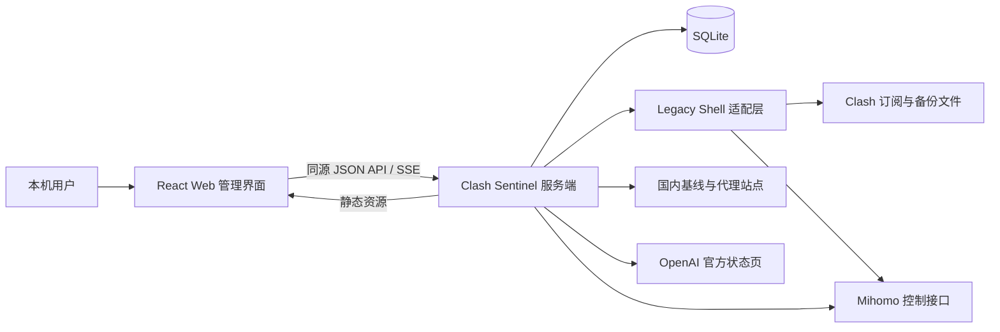
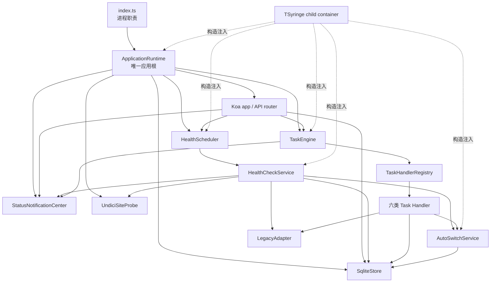
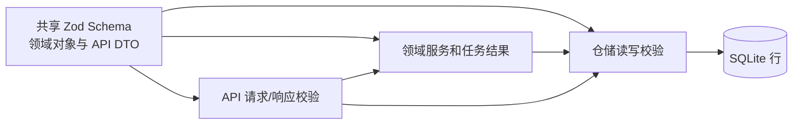
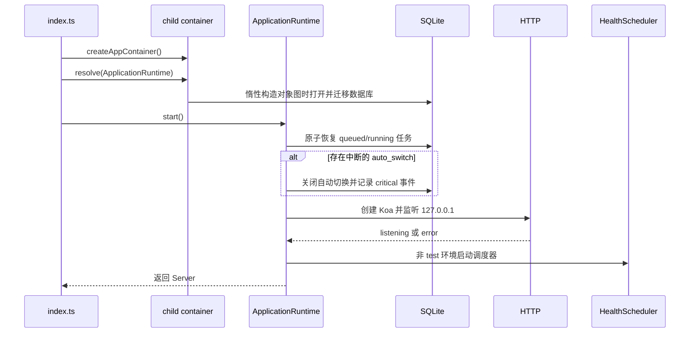
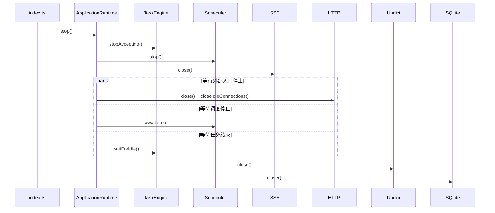
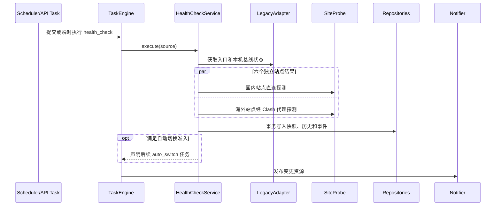
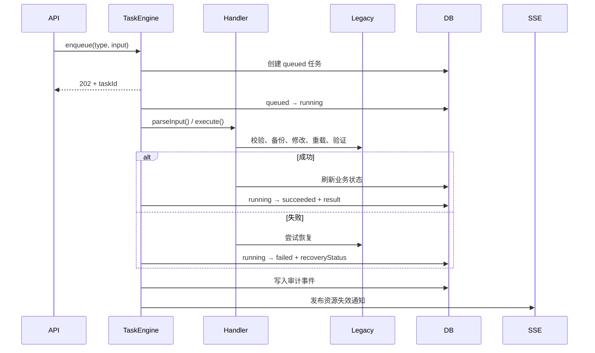
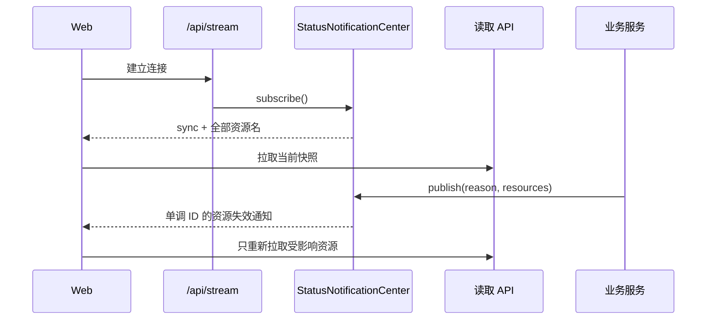
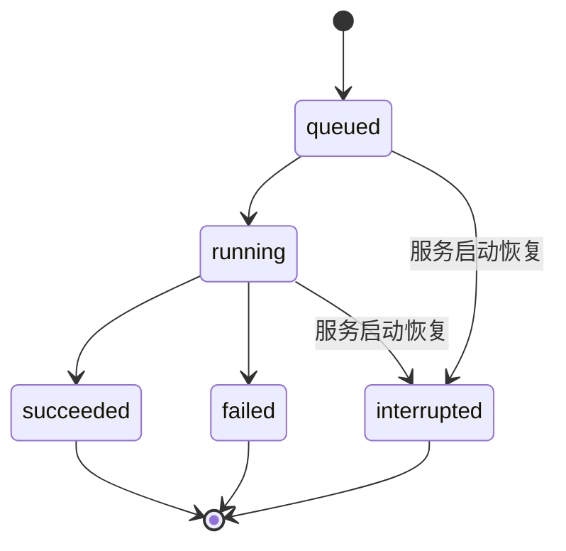

# Clash Sentinel 服务端设计

> 状态：已实现，随服务端代码持续维护
>
> 适用范围：当前 MVP（macOS + Clash Verge Rev / Mihomo，本机单进程部署）
>
> 目标读者：维护者、服务端开发者、前端契约使用者和验收人员
>
> 最近核对：2026-09-18，Step 17

本文是服务端设计的统一入口，说明系统为何这样设计以及各部分如何协作。精确的 HTTP/SSE
契约见 [API 设计](api-design.md)，精确的 SQLite 结构见[数据库设计](database-design.md)，依赖注入
机制和项目约束见 [TSyringe 专题](tsyringe.md)，生产类、接口、公共成员和 UML 关系见
[类与接口设计](server-class-design.md)。

## 1. 文档约定与事实源

本文采用轻量 arc42/C4 结构：先说明上下文和边界，再说明模块、运行时、关键流程和质量属性，
最后记录设计决策与可追溯关系。图使用 Mermaid，随 Markdown 一同版本化。

代码和文档不一致时，以下事实源优先；修改事实源时必须在同一个变更中更新对应设计文档：

| 主题 | 最终事实源 |
| --- | --- |
| 公共领域类型和 API DTO | `packages/shared/src/` 中的 Zod Schema |
| HTTP/SSE 路由和错误映射 | `apps/server/src/api/router.ts`、`app.ts`、`api/errors.ts` |
| 数据库结构和迁移 | `apps/server/src/storage/migrations.ts` |
| 任务执行语义 | `services/tasks/task-engine.ts`、`handlers/` 和 `contracts.ts` |
| 健康与自动切换策略 | `services/health/`、`services/auto-switch/` |
| 依赖与生命周期 | `composition/`、`application-runtime.ts`、`index.ts` |
| 配置、路径和日志 | `config.ts`、`project-paths.ts`、`logging.ts` |

## 2. 目标、边界与约束

服务端是运行在用户本机的单进程控制服务，负责：

- 定时或按需检测本机网络、受管入口、代理站点和 OpenAI 官方状态页；
- 调用已有 Legacy Shell 能力完成诊断、锁定、重置和回滚；
- 在严格安全条件下自动选择不同的合格入口 IP；
- 将设置、快照、诊断、任务和审计事件持久化到 SQLite；
- 向同源 Web 页面提供 JSON API、静态资源和 SSE 失效通知；
- 在进程启动、异常和退出时恢复或释放全部本机资源。

首版明确不负责公网访问、多用户鉴权、远程设备管理、通用 Clash 配置编辑、代理节点优选、
订阅购买或跨平台安装。服务只监听 `127.0.0.1:3000`；“切换 IP”只表示切换当前订阅同一入口
域名的候选 IPv4，不是切换代理节点或公网出口。

## 3. 系统上下文

主要信任边界：

- Web 请求、Legacy 输出、运行配置、HTTP 响应和数据库行都按不可信输入处理；
- 共享 Zod Schema、领域校验、数据库约束和输出脱敏共同形成防线；
- Clash 配置修改只能走受控任务，并遵循“校验、备份、修改、重载、独立验证、必要时恢复”；
- 原始订阅正文、控制器密钥、备份路径、报告路径和 Shell 原始输出不进入普通 API 或数据库。

## 4. 服务端组件

| 模块 | 职责 | 明确不负责 |
| --- | --- | --- |
| `index.ts` | Node 版本、容器创建、信号与全局异常、进程退出码 | 业务流程和依赖拼装细节 |
| `ApplicationRuntime` | 启动恢复、HTTP 监听、调度启动和有序停机 | 领域判断和请求路由 |
| Koa/API | 请求边界、校验、错误响应、静态资源和 SSE | 执行耗时动作或网络检测 |
| `TaskEngine` | 全局执行租约、任务生命周期、审计、通知和后续任务 | 各任务类型的领域细节 |
| Task Handler | 单个任务的输入、执行、结果和失败恢复映射 | 生命周期持久化和 SSE 广播 |
| 健康模块 | 六站探测、入口状态判定、失败计数和调度 | 直接修改 Clash 配置 |
| 自动切换模块 | 准入、候选选择、冷却和失效上下文处理 | 绕过诊断或恢复保护 |
| Legacy 适配层 | Shell 子进程调用、超时、解析和错误归一化 | 向 API 暴露原始输出 |
| 存储层 | 迁移、仓储、事务、校验、脱敏和保留策略 | 跨领域业务编排 |
| 通知中心 | 进程内 SSE 订阅和资源失效通知 | 保存或重放业务数据 |
| composition | token、作用域和完整对象图 | Service Locator |

依赖方向保持为“进程入口 → 应用编排 → 领域服务 → 适配器/仓储”。业务对象不访问默认容器，
也不接收容器实例。接口依赖通过 `Pick<>` 收窄，运行时用集中 Symbol token 解析完整实例。

## 5. 领域、接口与存储映射

关键对象关系如下：

| 领域概念 | API 表现 | 持久化位置 |
| --- | --- | --- |
| `Settings` | `/api/settings` | `settings` 单例行 |
| `HealthSnapshot` | `/api/status` | `health_snapshot` 单例行 |
| `SiteResult` | `/api/sites` | `site_snapshots` 和 `site_history` |
| `DiagnosisResult` | `/api/candidates` | `diagnosis_snapshot` 和 `diagnosis_candidates` |
| `StoredTask` | `/api/tasks/:id` | `tasks` |
| `StoredEvent` | `/api/events` | `events` |
| `MonitoringSnapshot` | `/api/monitoring` | 当前进程内调度状态，不落库 |
| `StreamNotification` | `/api/stream` | 当前连接中的失效通知，不落库 |

API DTO 不直接等同于数据库行。仓储负责时间、布尔值和 JSON 编解码，并在读取后再次通过共享
Schema。`stale` 等派生字段在读取时计算，不写入数据库。

## 6. 运行时生命周期

### 6.1 启动与恢复

容器解析阶段除 SQLite 外不产生网络连接或定时器。恢复必须在开始接收请求前完成；监听或恢复失败
由统一关停路径释放已经构造的资源。

### 6.2 优雅关闭

`stop()` 幂等；单项释放失败不会阻止后续释放，最终用 `AggregateError` 汇总。容器 `dispose()` 是
最终兜底，不替代上述业务停机顺序。

## 7. 核心业务流程

### 7.1 健康检测

国内三站至少两个可达才允许判断入口；本机断网或状态不确定时不增加入口失败次数。Google、
GitHub 和 OpenAI 状态页结果独立展示，不触发也不阻止入口切换。定时检测使用瞬时任务语义，
手动检测和自动切换使用可查询的持久化任务语义。

### 7.2 手动配置任务

`apply`、`reset` 和 `rollback` 都通过全局任务租约串行执行：

`recoveryStatus` 区分 `not_required`、`recovered`、`recovery_failed` 和 `unknown`。恢复失败或状态
未知时必须保守地关闭自动切换，由用户检查运行配置后重新启用。

### 7.3 自动切换

自动切换只有同时满足以下条件才可规划和执行：开关已启用且绑定当前订阅、健康状态为
`entry_down`、国内基线至少两个成功、连续失败达到阈值、不在冷却中、入口已经受管锁定、没有
操作冲突。严格诊断完成后，只从 `eligible` 候选中选择不同于当前 IP 且平均延迟最低的一项，
延迟相同时按 IP 稳定排序。

没有不同候选时以 `no_change` 成功终态记录；每次真正进入自动处理，无论无候选、切换成功或
已经恢复的失败，均从结束时开始冷却。订阅上下文变化、恢复失败/未知或进程中断都会关闭开关并
清空绑定 UID。

### 7.4 SSE 同步

SSE 不承载完整业务快照、不保证跨进程重放，也不能代替 SQLite。通知 ID 仅在当前进程内单调；
客户端断线后通过重新连接收到 `sync`，再从读取 API 获取事实状态。

## 8. 状态与并发规则

### 8.1 任务状态机

六种任务类型为 `health_check`、`diagnose`、`apply`、`reset`、`rollback`、`auto_switch`，每种类型
恰好对应一个 Handler。任务状态为 `queued`、`running`、`succeeded`、`failed`、`interrupted`。
Task Engine 负责公共生命周期，Handler 只返回结果、变化资源、审计内容和声明式后续任务。

### 8.2 全局操作租约

所有 Legacy 动作共享一个进程内执行槽，避免同时读取或修改共享报告、状态和 Clash 配置。API
重复提交返回 `ACTION_CONFLICT`；持久化任务冲突提供 `activeTaskId`，定时健康检测冲突提供固定的
`activeOperation`。任务在 `202` 返回后异步执行，后续失败不得重写已经发送的 HTTP 响应。

服务关闭先拒绝新任务，再等待当前不可中断动作结束。异常退出遗留的 `queued`/`running` 任务在
下次启动时统一标记为 `interrupted`，不会自动重放配置修改。

## 9. 配置、路径与部署

- Node.js 版本固定为 24；生产入口启动时再次检查版本。
- 配置从 `config/default.yaml` 或 `CLASH_SENTINEL_CONFIG` 指定文件加载并用 Schema 校验。
- 数据库路径按显式构造参数、`CLASH_SENTINEL_DB_PATH`、项目 `.state/` 的顺序解析。
- Legacy 脚本、运行配置、状态、报告和备份路径由 `RuntimePaths` 集中解析，不依赖进程 cwd。
- HTTP 监听值作为 `httpListen` token 注入；生产值固定为 `127.0.0.1:3000`，测试可覆盖临时端口。
- 开发使用 `tsx`，生产使用 TypeScript 构建产物；三种环境共用同一容器注册和应用根。

## 10. 安全、隐私与错误

- JSON 请求最大 32 KiB，未知字段拒绝；任务/事件开放 JSON 同样受大小限制和递归脱敏。
- API 错误只返回稳定错误码、安全文案、字段路径或活动任务标识，不返回堆栈、密钥、本机路径、
  原始输入、配置正文或 Shell 输出。
- 每个响应包含 `X-Request-Id`，错误正文同时包含同一个 `requestId`，用于关联日志。
- 日志元数据统一清理错误对象和敏感键；日志与数据库脱敏分别由配置控制。
- 读取接口不得启动 Shell、网络检测、任务或审计事件；`/api/monitoring` 只额外读取调度器内存态。
- 所有写配置动作重新校验订阅 UID、文件指纹、诊断时效和候选资格，不能信任前端确认时的上下文。
- 数据库只保存恢复业务所需的最小摘要；WAL 主文件和伴随文件被视为同一敏感本地数据集。

## 11. 可观测性与故障处理

日志使用稳定 scope 区分启动、API、任务、调度、SSE、Legacy 和存储行为。任务表提供异步动作状态，
事件表提供用户可读审计，站点历史提供有限趋势数据；三者用途不同，不互相替代。

主要故障策略：

| 故障 | 行为 |
| --- | --- |
| 配置或路径无效 | 启动失败，不以默认猜测继续运行 |
| HTTP 监听失败 | 进入统一停机，释放数据库、探测器和已构造资源 |
| 单站探测失败 | 保存该站点错误，不制造虚假延迟，不直接归因入口 |
| 本机基线不足 | 标记断网或不确定，不增加入口失败次数 |
| Legacy 超时/解析失败 | 转为稳定领域错误，原始细节只进入受控日志 |
| 配置动作失败 | 尝试恢复并持久化恢复结论；不把文件恢复等同于运行恢复 |
| SSE 客户端异常 | 隔离并关闭该订阅者，不影响其他客户端和后台任务 |
| 服务重启遗留任务 | 标记 `interrupted`；中断自动切换时关闭开关并写关键事件 |
| 停机单项失败 | 继续释放其余资源，最终汇总错误 |

## 12. 依赖装配决策

服务端使用一个生产 child container。所有进程级可变服务采用 `ContainerScoped` 或 child 内缓存
工厂；禁止 `@singleton()`，避免测试 child 之间共享实例。全部构造参数显式使用 Symbol token，
不依赖 `emitDecoratorMetadata`；`reflect-metadata` 必须先于 TSyringe 加载。

单元测试继续直接构造服务。只有验证完整对象图、作用域、依赖覆盖或应用生命周期的测试才创建
独立 child container，并在结束时释放。详细原因和库行为见 [TSyringe 专题](tsyringe.md)。

## 13. 关键设计决策

| 决策 | 选择 | 主要原因 |
| --- | --- | --- |
| 应用根 | 唯一 `ApplicationRuntime` | 集中启动恢复与停机顺序，避免第二套组合根 |
| 依赖注入 | 显式 Symbol token + child scope | 接口和 `Pick<>` 无运行时类型，且测试需要隔离 |
| 任务扩展 | 固定类型到 Handler 注册表 | 生命周期与业务执行解耦，编译期保证类型覆盖 |
| 持久化 | 本机 SQLite + 领域仓储 | 单机部署、事务恢复和零外部服务依赖 |
| API 动作 | `202` + 可查询任务 | 耗时 Shell 操作不占用请求，失败结论可恢复查询 |
| 读取语义 | 只读快照，无隐式刷新 | 页面刷新不会意外执行网络或修改本机配置 |
| 实时更新 | SSE 仅发送失效通知 | SQLite/API 保持单一事实源，断线恢复简单 |
| 自动切换 | 保守准入和失败关闭 | 配置错误的代价高于延迟恢复 |

## 14. 测试策略与可追溯性

| 需求/风险 | 设计位置 | 主要实现 | 主要测试 |
| --- | --- | --- | --- |
| API 契约与脱敏 | 第 5、10 节 | `api/router.ts`、`app.ts` | `app.test.ts`、共享 Schema 测试 |
| SQLite 约束与恢复 | 第 5、6、8 节 | `storage/`、`startup-recovery.ts` | connection/store/repository/recovery 测试 |
| 健康判定不误切换 | 第 7.1、7.3 节 | `services/health/`、`auto-switch-policy.ts` | health 和 auto-switch 测试 |
| 配置动作安全闭环 | 第 7.2、8.2 节 | Task Handler、LegacyAdapter | task-engine、adapter 和 app 测试 |
| SSE 断线同步 | 第 7.4 节 | `status-notifier.ts`、router | notifier 和 app 测试 |
| 对象图和作用域隔离 | 第 12 节 | `composition/` | graph/container/architecture 测试 |
| 启停无资源泄漏 | 第 6 节 | `application-runtime.ts`、`index.ts` | application-runtime 测试 |

验收基线包括 Vitest/Supertest、TypeScript 类型检查、ESLint、Prettier、生产构建和真实终端冒烟。
设计文档变更至少执行 Markdown 格式与链接检查；涉及事实源的代码变更还必须运行对应测试。

## 15. 已知限制与演进方向

- SSE 没有跨进程游标和事件重放；当前单进程部署通过重连后的 `sync` 满足需求。
- 全局任务槽限制吞吐，但避免共享 Shell 状态和配置文件并发；并行化必须先消除这些共享边界。
- SQLite 保留固定数量的历史，不提供长期指标仓库或外部监控导出。
- Legacy Shell 仍是配置修改和严格诊断的权威执行器，服务端通过适配层降低但未消除耦合。
- 首版没有用户认证，安全前提是只绑定回环地址；任何公网访问能力都必须先补鉴权、CSRF 和权限模型。
- 当前只支持 macOS 和 Clash Verge Rev / Mihomo；跨平台前需抽象路径、进程、代理配置和控制接口。

前端设计应以本文的边界、[API 设计](api-design.md)和共享 Schema 为依据，不从数据库表或服务端
内部状态推导页面契约。
